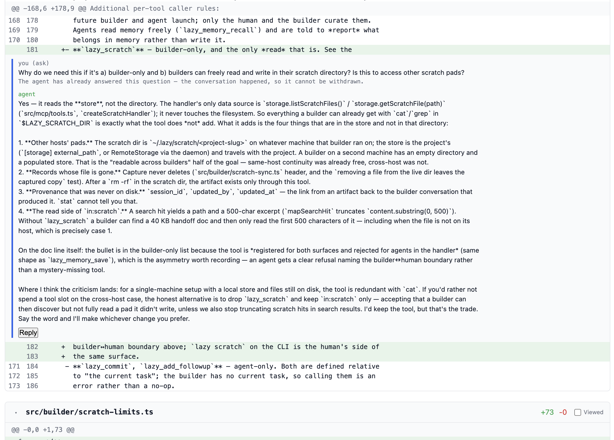

# `lazy`

`lazy` is:

* A secure, locally hosted agent [orchestrator](#the-orchestrator): `lazy` is both a software development lead (`builder` mode) and a fleet of autonomous agents working on your behalf, concurrently and asynchronously.
* A [proxy](#the-proxy) for AI-human collaboration: `lazy` captures conversations, reviews, and decisions in a searchable data store, under your control and giving both you and your agents improved situational awareness.
* A [software development lifecycle](#the-task-manager) tool integrating `git`: `lazy` treats the task -> work -> review -> acceptance/rejection cycle as a first-class development abstraction implemented through `git`. The same way the proxy wraps coding assistants and you don't invoke them directly, `lazy` removes the need to directly interact with `git`.

## What are the main benefits

* Prolonged autonomous horizon for agents (hours not tens of minutes)
* Autonomous, concurrent, asynchronous (turn based) work across many tasks
* Increased agent situational awareness (agents can search over all past tasks and prompts)

## Quick Start

```bash
# Clone lazy source, build the binaries, create ~/.lazy/bin and install the binaries there.
git clone git@github.com:getlazy/lazy.git
cd lazy
bun run install:local
# After this run `lazy upgrade` in the projects where lazy is already initialized

# Initialize lazy in your git repository. This will detect the remote repository
# and other things like different runners (e.g. is there Docker)
cd your-hello-lazy-project/
lazy init

# Launch the agent in interactive mode with an additional lazy's system prompt
# and tell it what tasks to create and start.
lazy builder # Ask it "what can you do?"

# To review all the prompts that `lazy` uses run `lazy system prompts`
# To view the content of individual prompts use `lazy show <prompt-code>`

# Or create tasks directly
lazy create --code add-auth --goal "Add user authentication" --prompt "Use JWT tokens, bcrypt for passwords"
lazy start <task-id>

# Review the agent's work while chatting with agent itself
lazy review -i <task-id>

# Or ask a single read-only question without entering the review TUI
lazy ask <task-id> --message "why did you drop the retry?"

# On a rare (and they truly *ought* to be rare) occasion you may need to pair directly
# with the agent, use `lazy pair` to the agent's session but now with you in control
lazy pair <task-id>

# For a back-and-forth conversation instead of a single question — with a paused
# task or with one that has long since finished — chat with its agent read-only.
lazy chat <task-id>

# Accept and merge to main
lazy accept <task-id>

# Protect tasks (or non-lazy git branches) you don't want to allow builders to merge into
lazy protect <task-id or branch-name> on # And take off protection by passing `off` instead

# Or reject if it's not right
lazy reject <task-id> --reason "Needs to use sessions instead of JWT"

# Or close it if you don't even want to do it
lazy close <task-id> --reason "Won't do"

# Sometimes you will want to stop the task and give it new direction with maybe a different model
# or a different level of effort.
lazy stop <task-id> --reason "We need to pivot"
lazy unblock <task-id> --message "New direction to pivot to with a different model" --model some-different-model
```

## Core components

When you build `lazy`, you get a single executable. This executable will include in itself `lazy-agent` a Linux build of `lazy` with a different CLI surface that runs inside of Docker containers. The agent binary is mounted into Docker containers at runtime. Those are the two core components.

When you run `lazy` inside of a `lazy` initialized project, it will start running as daemon. Daemon is project aware and there is a single daemon running for the project. Daemon runs task reconciliation, CI checks, PR comment harvesting and so on in the background and is the beating heart of the system. `lazy` was originally built just as CLI but later it became obvious to me that it needed a component that actively listens to events so I took a page from `tmux` book. You can check daemon state through `lazy daemon` commands.

Furthermore, the daemon also runs an HTTP proxy through which *all* agent requests toward their upstream model providers are streamed through. This allows some hardening (e.g. no tool calls allowed to directly read ~/.ssh for example), 

Also, whenever you rebuild `lazy`, you need to run `lazy upgrade` to rebuild the `lazy` Docker image for your toolchain and upgrade daemon. Same as with daemon this upgrade will be per project.

## Core Concepts

* Agents do the coding and (most of) reviewing, you focus on the product, the architecture and giving guidance to unblock the agents.
* Your time is precious, agent time is aplenty. This permeates all interactions with `lazy` including direct conversations. Watching agents write code and yanking them when they go astray is *micromanagement*.
* Prompts and their context are valuable, code is a byproduct. `lazy` automatically keeps track of all conversations, prompts, turns, comments, feedbacks.
* Primary interface is the conversation - let `lazy`'s `builder` be your team lead - but you always have `lazy`'s deterministic tools at your disposal.
* Software development lifecycle is not an afterthought - it's front and center of `lazy` way of building software.

## Project Status

`lazy` is **alpha software** under active development. The core workflow is stable, but:

- I make no guarantees to its quality, correctness or safety
- Breaking changes may occur in storage schema or CLI interface
- Some (maybe even most) features are experimental
- Error messages are improving but may be cryptic

`lazy` is definitely not in an awesome shape, its tests fail, it's inconsistent, etc. but it's very, very fun to use. At least for me!

### Contributing

`lazy` is being actively developed. You can contribute by:

- Sending me feedback at [feedback@getlazy.dev](mailto:feedback@getlazy.dev)
- Reporting [bugs or feature](https://github.com/getlazy/lazy/issues) requests
- Submitting [**Prompt** Requests](https://github.com/getlazy/lazy/issues) for fixes or enhancements.
- Testing experimental features - if you are interested, send me an email to [testing@getlazy.dev](mailto:testing@getlazy.dev)

`lazy` is built using `lazy` itself. At this time, I am not accepting code contributions to its code base, which is why "Pull Requests" is not even offered.

## FAQ

### Why build `lazy`?

On one hand I felt that by throwing away prompts, we are not raising the abstraction of software development. I feel that that is akin to writing in a higher level language, compiling that to machine or p-code, then committing *that* code and deleting the original source code. It's not *exactly* the same of course but it is... akin.

On the other hand, I was tired of "pair programming" with coding assistants but felt that current tooling was not optimal for what I was trying to do. I don't want to chat with agents and become a blocker. Instead, I want to give them actionable feedback, asynchronously, on my own good time, and let them do their thing in the meantime.

Finally, I felt that forges were just not able to deal with the way I wanted to work, with a *lot* of automated comments, reviews, etc. They were built for humans and it was obvious they were not designed to deal with the new workflows that were emerging.

Finally, finally, I also decided to make an experiment of building a useful software system from scratch with **zero** coding on my part. At that at least I have succeeded.

`lazy` is thus [my](https://github.com/ierceg) attempt to raise the abstraction on three different fronts at the same time:

* **Prompts**: rather than throwing them away, `lazy` captures them so that both humans and agents can reference them and learn from them.
* **Agents**: rather than working interactively with *coding* agents, `lazy` offers a way to work asynchronously with them *and* interactively with the intelligent orchestrator which is *also* aware of the prompts repository *and* task management features.
* **Source control**: rather than dealing with low-level pinnings of `git`, `lazy` wraps these mechanics into a task lifecycle management.

I see a lot of people building and running their own orchestration layer and I think it's great. I expected this and I'm certainly not part of the 1st wave but more of "fine, I'll do it myself" wave. I expect this trend to continue leading to fragmentation the likes of which we have not seen since Linux distro ecosystem bloom.

### Why name it `lazy`?

Two reasons:

1. It's a nod to the original `lazy` project, the Hackable Coding Assistant that I built with my friend [neboysa](https://github.com/neboysa) back in 2016 to 2017. You can find it at [github.com/getlazy/lazy-og](https://github.com/getlazy/lazy-og)
2. This quote from [Robert A. Heinlein](https://en.wikipedia.org/wiki/Robert_A._Heinlein) (in spite of me being an early riser!):

> Progress doesn't come from early risers—progress is made by lazy men looking for easier ways to do things.

*Time Enough for Love (p. 54)*

`lazy` is my easier way of building software in the agentic age. I didn't like what I saw out there and I felt that it had to be built in a certain way, maybe idiosyncratic to me. To [paraphrase](https://en.wikipedia.org/wiki/Rifleman%27s_Creed):

> This is my way of building software. There are many like it, but this one is mine.

I hope you get as much fun from this (or more!) as I have.

### Why Not Just Use <X>?

See above. Plus building `lazy` is fun, building with `lazy` is fun and building `lazy` with `lazy` is *extra* fun. Occasionally it is also *extra* frustrating but hey, what is programming if not a perpetual act of [frustration](https://x.com/CodeWisdom/status/1452004401774739464).

### What is `lazy` particularly good at compared to native Claude Code?

From the point of view of the quality of one-shot code or similar - nothing whatsoever. From the point of view of experience of software development, where Claude Code aptly leverages subagents to launch work in the background, `lazy` uses its task system to do the same. `lazy` plans the work and fires off tasks and then gives *you* the control to do something else while the task or tasks are running. The difference, to me, is similar to the difference between real-time strategy games, where your reflexes dominate the outcome (how many times *today* have you slammed ESC to stop Claude Code going off the rails?), to turn-based strategy games, where you asynchronously plan and make your moves and then let the opponent take its turn. To me, it is liberating to review after the agent's turn, instead of watching reams of text fly by, hoping to gain some semblance of control.

Beside that, `lazy` does a lot of little "quality of life" things that are otherwise annoying with agents:

* Before agent's turn `lazy` inject goals of the task into the prompt, in order to avoid goal drift and stabilize the agent's output.
* Before agent's turn `lazy` automatically merges task's branch with origin branch and parent task's branch (e.g. main) so that the differences are never too large. Conflicts are resolved by the agents with a specially crafted prompt.
* After agent's turn `lazy` checks agent's work for file permission violations in order to make potential reward hacking (e.g. deleting tests it doesn't "like") obvious and rejectable by default.
* `lazy` has specific verbs and specialized prompts for different types of tasks, similar to skills but that go well beyond that. For example, there is a built-in `redo` command which acts like smart rebase redoing the work already done, from scratch, on top of latest HEAD, repeating the exact same goal and prompt.

### What is `lazy` particularly bad at?

Originally, it was really annoying when I would be preparing a new release and doing a lot of integration tests. This polishing would expose a number of smaller issues which in stable state are fine to fire off as small tasks but when you are trying to release, it becomes too heavy handed. The whole thing that makes `lazy` great to use in normal process, is what makes it not great to use when you have a number of very small issues that need more interactive polishing. But now you can use `lazy pair` without task ID, right on the branch that you want to modify (e.g. `release-v011`) and with it can go back to working in the traditional "micro-management" style which feels exactly right for small, last minute polishing tasks.

Another thing that is annoying are bootstrapping failures: `lazy` failing so hard that I cannot fix it using `lazy`. But that is very rare these days and besides, it's only annoying to me.

### Why use Docker?

I want to make the default onboarding path both safe and easy and I think docker is well established in the software development. Docker is not universally loved but it pretty much universally **used**. And it gave me one crucial thing: agents are isolated from the host's file system which minimizes the chances of catastrophic consequences of prompt injections. *They* could of course be prompt injected, they have access to the network after all and run autonomously. But the only way for them to affect your host machine is by injecting behavior into the code which you then blindly run on your box. By adding `builder` layer, which also runs isolated, as the first reviewer, I again lowered the chances of such attacks passing through. This doesn't eliminate them but I don't see how to eliminate that short of refusing to use agents to write code.

## The Details

### The proxy

`lazy` is a thin proxy that sits between you and AI coding agents, managing tasks as bounded units of work with full conversation history:

- Captures conversations between you and the builder, the agentic team lead
- Captures interactions (prompts, comments, feedback) in a searchable data store that agents themselves query during their work for improved situational awareness
- Enables search, for both you and all agents, across all task conversations, prompts, turns, and comments

That said, `lazy` *also* sits between your coding agent and the LLM model provider it is using, monitoring all the requests that are going through. Right now this is used for collecting statistics and intercepting *some* malicious tool calls but over time there are other things that can be done at this layer (e.g. smart model routing, automatic token optimization and so on)

### The orchestrator

AKA "the `builder`".

- Interact with the `builder` agent directly through conversations and let it interact with agents through turn by turn feedback *OR*
- Use deterministic CLI tools for that task and work management including agent feedback
- Or do both at the same time!

All `builder` and autonomous agent sessions run in isolated containers with only the repo being mounted on them. Each task is also isolated in its own worktree and `git` branch. There are further differences:

* `builder` sessions only have read-only access to repository. This is to prevent... builders too zealous to help with writing code. Builders are meant to orchestrate and that is enforced.
* Agent sessions obviously get full access to the worktree and read-only access to the repository itself. But their access to repo's `.git` is split and they cannot move git refs on their own (they can only commit using `lazy_commit` MCP)
* They are also isolated from one another in `lazy`'s daemon, each receiving a specific token to authenticate so that one agent cannot affect worktree of another agent.

The process isolation is necessary as `lazy` runs **autonomous** agents which means that they are exposed to prompt injection risk. Furthermore, the `builder` agent, which while running interactively is not as exposed (you have to give it permissions to read things from the net), reviews summaries and code written by the autonomous agents which means that, through that channel, it is **also** exposed to prompt injections. The only entity *not* exposed to the prompt injection is the user. Hence it is the user that finally **must** accept the source code - after adequate reviews. I **strongly** encourage using deterministic security tools and review agents for the code written in this way.

The current mechanism for this isolation is [Docker](https://docker.com). Docker is a lousy choice for *development* but it's easy to isolate. Alternative is to run `lazy` on its own VM and direct processes mode - but this is still highly experimental. I **strongly** discourage running `lazy` on the host in direct process mode as each agent runs fully autonomously and is therefore susceptible to prompt injections.

#### Security posture — inherited account connectors are denied by default

> **`lazy`'s model-traffic proxy denies inherited `mcp__claude_ai_*` account connectors by default.**

**This is always on.** All agent model traffic routes through `lazy`'s proxy — no configuration required, and no way to turn it off. That holds for every backend: a role backed by a local Ollama, or pinned at an explicit `endpoint`, is forwarded there *by the proxy* rather than dialed by the agent. That chokepoint runs a **mechanistic, injection-scanning policy engine** that inspects every `tool_use` an agent proposes *before it executes* and rewrites the response to block a violation. These policies are currently simple in nature and they cannot prevent a sophisticated attack but again, this is all within the context of running inside of a container without any way to directly commit outside of the worktree

The load-bearing reason this exists: an agent running under a **claude.ai account silently inherits that account's server-side connectors** — Gmail (read/draft/search), Google Drive, Calendar, Spotify and more — as live, callable tools. These `mcp__claude_ai_*` tools are injected by Anthropic from the authenticated account; **nothing in `lazy` or your local config enables them, and neither the OS sandbox nor Claude Code's own permission settings ever see them.** The proxy is the only place `lazy` controls where they can be stopped, so the default is closed:

- **`mcp__claude_ai_*` connectors are denied by default**, allowlist-only. A denied connector call is blocked and the agent is told why.
- **Secret/credential path reads are denied** (`~/.ssh`, `.env`, `.aws/credentials`, private keys, `.npmrc`, kubeconfig, …).
- **Optional** path-glob denies and a WebFetch egress allowlist.

These deterministic rules are the *real* security boundary — a prompt-injected agent cannot argue its way past a static rule, and the decision is identical for every backend (real Anthropic, Ollama, Cursor).

To **allowlist** a specific connector you actually want an agent to use, name it exactly under `[proxy.policy]`:

```toml
[proxy.policy]
enforce = true                    # default true
connector_allowlist = [           # re-allow only these inherited connectors, by exact tool name
  "mcp__claude_ai_gmail_search_threads",
]
deny_secret_path_reads = true     # default true
# deny_path_globs = ["/etc/**", "**/*.key"]
# egress_allowlist = ["api.github.com"]   # empty/unset = egress unrestricted
```

If the proxy cannot start, the daemon refuses to start rather than silently connecting direct, and a launch that cannot resolve the running proxy's live address fails with an actionable error rather than downgrading to a direct connection — a silent fallback would leave the audit trail lying by omission.

#### My MO for polishing

When I have very complex task (e.g. preparing a release or a novel CLI surface that I am not yet sure about) that I need to polish I will:

* Split terminal into three vertical screens
* Run the builder on the left side
* Pair with the task on the middle
* Shell into the task's worktree and test it on the right side

This way I focus on switching between testing and pairing and occasionally switching to builder either for filing new tasks or subtasks that I may want to do beyond the polishing effort.

### The task manager

- Create tasks with explicit goals and prompts for agents, track them through turns, accept or reject them
- Assemble tasks into larger coherent wholes (features, releases) and hierarchies (tasks -> features -> releases -> main)
- Sync with remote repos for PR creation, comment syncing, and remote collaboration (GitHub and GitLab support)

The feel is one of task-aware `git`. For example, if an agent is working on a task and you accept its sub-task, `lazy` will refuse to merge until the parent task has finished running. Also, on every agent turn, the first thing that is done is syncing with upstream (parent's branch) and resolving conflicts. This can sometimes lead to suboptimal results but the sooner the conflicts are resolved the better it is. And in case the task is really falling behind its parent, then you can always run `lazy redo` to redo the task from scratch (from parent's current HEAD). This is in a way `rebase` powered by LLMs.

## Prerequisites

- **Claude Code** - `lazy` wraps Claude Code (install from [code.claude.com](https://code.claude.com/docs/en/setup)) (more agents coming!)
- **Bun** — `lazy` is built on Bun (install from [bun.sh](https://bun.sh))
- **Docker** — Agents run in isolated containers (install from [docker.com](https://docker.com))
- **Git** — Required for version control and worktree management

For remote repo integration:

- **GitHub CLI** (`gh`) (`brew install gh` or see [cli.github.com](https://cli.github.com))
- **GitLab CLI** (`glab`) (`brew install glab` or see [docs.gitlab.com](https://docs.gitlab.com/cli/))

## Installation

### Build from Source

```bash
# Clone the repository
git clone https://github.com/getlazy/lazy.git
cd lazy

# Install dependencies and build
bun install
bun run build

# Install to ~/.lazy/bin/
mkdir -p ~/.lazy/bin
mv lazy ~/.lazy/bin/
mv lazy-agent ~/.lazy/bin/

# Or simply run `bun run install:local` to do both ^^

# Add to PATH and set completions
echo 'export PATH="$HOME/.lazy/bin:$PATH"' >> ~/.bashrc  # or ~/.zshrc
echo 'eval "$(lazy completion --zsh)"' >> ~/.bashrc  # or ~/.zshrc
source ~/.bashrc # or rather obviously ~/.zshrc
```

`lazy` is the CLI you interact with while the `lazy-agent` is the entrypoint that runs inside Docker containers and which in turn invokes the agent.

Verify installation:

```bash
lazy --version
```

### Authentication Setup

`lazy` wraps around Claude Code which requires that you setup its OAuth token as envvar. `lazy` does not store or otherwise capture this information - it just passes it along so that Claude Code can read it.

```bash
# Option 1: Anthropic API key
export ANTHROPIC_API_KEY="your-key-here"

# Option 2: Claude Code OAuth token
claude setup-token
# Then set CLAUDE_CODE_OAUTH_TOKEN
```

The credential is **required for the daemon to run at all**. The daemon is what
launches task containers, and those containers inherit its credential — so a
daemon without one would spawn agents that cannot reach the model API. Every
path that starts a daemon (`lazy daemon start`, `lazy daemon restart`, `lazy
upgrade`, and the auto-start that fires on any ordinary `lazy` command) refuses
with an actionable error when neither variable is set. A variable that is set
but blank — what a failed `export CLAUDE_CODE_OAUTH_TOKEN=$(claude setup-token)`
leaves behind — counts as absent.

The check is presence-only and never calls the API: daemon startup must not
depend on network reachability, and a credential that is valid at start can
expire an hour later anyway. A credential that is present but rejected surfaces
as a 401/403 from the model API in the agent's own output.

Because the daemon owns the credential, `lazy doctor` reports on the **daemon's**
environment rather than the shell you run it in — so exporting the token only for
the daemon no longer reads as "not authenticated", and a stale token lingering in
your shell no longer reads as healthy. It asks the daemon over its local socket,
which answers with presence and the variable *name* only; the credential itself
never travels back. If the daemon cannot be asked, doctor still answers from your
shell but labels the result `shell env: …` and says why.

If you run a local model instead, set `[ollama] enabled = true` in `lazy.toml` — the gate
is skipped for Ollama-backed setups, which use local stand-in credentials. (A per-role
`[models.roles.*]` table with `backend = "ollama"` launches without a real credential too,
but the daemon-start gate reads the `[ollama]` block only.)

For GitHub integration (optional):

```bash
gh auth login
```

For GitLab integration (optional):

```bash
glab auth login
```

## Real-World Configurations

What follows are recommendations for real-world configurations.

### Host development

If developing on host, I **strongly** encourage leaving the default docker runner. It is built for this use case where its necessary to isolate autonomous agents from the host system. When running in docker, the agents only have access to repo itself and network (by default - though that can be turned off) and nothing else.

```
[runner]
type = "docker"
```

Or just leave out the configuration of the runner - it's docker by default.

### VM development

If you have complex dependencies or environment requirements, I recommend developing in an isolated VM, which doesn't have anything but the repo and your development environment. I **strongly** recommend creating a specifically crafted token for remote repositories to minimize any dangers of possible prompt injections affecting remote repositories.

If all of the above is true, then yes, with trepidation, you can use:

```
[runner]
type = "dangerously-host-process-without-any-isolation"
```

The name says it all - you really **ought** to **never** run like that unless in an isolated environment.

Regarding VM, there is one more thing that you will likely want to do which is to configure a different `lazy.toml` file to be used inside of VM. This is useful if you sometimes work in the VM and sometimes on the host or if there is a difference the way team mates work. To make use of that, override `LAZY_CONFIG` envvar inside of the VM to point to the alternative lazy.toml. For example, in this repo you will find `lazy.lima.toml` which uses this technique to pass the correct **VM** configuration which has the host runners unlike the host lima configuration which uses docker runners.

### Storage Location

By default, `lazy` stores task data in `~/.lazy/<project-name>/`. You can customize this location by setting `storage.external_path` in `lazy.toml` to store data elsewhere — useful for backups or storing in a separate repository for safekeeping.

## Details

### `lazy builder`

An interactive session with Claude Code with the addition of `lazy`'s own system prompt, guiding the conversation toward task creation, orchestration and reviewing. Work with `builder` to:

- Ideate, plan work, create new tasks.
- Start tasks and keep track of their progress.
- Review tasks and give them feedback.
- Schedule task acceptance trains.
- Decide on priorities and directions.

In `builder` mode, the assistant is prevented from doing anything directly on the repostiory by:

* Build is running in a container and repository is mounted as read-only.
* All `lazy` operations that it performs go through the deamon running on the host.
* There is no `lazy` CLI in the container and even if it were to install one, all operations still have to go through the same external daemon.
* All requests to model provider go through `lazy` proxy.

Thus builder is lock down so that it can *only* launch tasks, direct them, etc. and finally also accept but limited to non-protected tasks and branches (see [task/branch protection](#protected-branches-and-tasks)). Such hard-lockdown posture is also why `builder` we consider safe to run builders in **autonomous mode by default** — no per-tool permission prompts Each autonomous launch prints that posture and asks you to type `yes`; `--yes` skips the confirmation, and `lazy builder --no-autonomous` opts back into Claude Code's normal permission prompts.

Builder does get one writable place — `~/.lazy/scratch/<project>/`, outside the repo entirely — for artifacts meant for *you*: a long accept message, a draft doc, a data dump. It can never be committed and no agent can read it. See [public-docs/builder-scratch-dir.md](public-docs/builder-scratch-dir.md).

The user <-> `builder` <-> agent relationship follows a clear division of labor:

- The **user** sets direction and make decisions, plan larger work ("release so and so will have features this and that")
- The **`builder`** helps scope work and manage tasks with goals and prompts, and preliminary or full feedback to the agents
- The **agents** write code

Again, the `builder` never touches code directly — it creates tasks with goals and prompts, starts agents, and reviews their output. Think of it as working with a tech lead who delegates to a team of engineers.

The typical workflow:

- You tell the `builder` what you want and you chat about it a bit
- `builder` offers to create certain tasks, and then starts them thus launching agents
- Agents work autonomously and concurrently until they finish or need guidance, and `builder` and you review the results.
- You either accept or provide feedback at which point agents continue their work.

Use `lazy blocked` to see what's ready for review, and `lazy loop` to review everything in sequence. Or ask the `builder` to wait for the tasks and let you know what it thinks of the work.

To work through a curated pile of small tasks instead, give `lazy loop` the list: `lazy loop fix-a fix-b fix-c` starts each one in turn, waits for it, shows you the review gate, and moves on when you decide. `--backlog --parent <hub>` picks the list for you; `--pipeline` starts the next task while you review the current one. See [docs/design/loop-queue-mode.md](docs/design/loop-queue-mode.md).

### Agents

Agents work in isolation — each runs in its own Docker container with a dedicated `git` worktree. They can search past task history via MCP tools to understand prior decisions, but they don't coordinate with each other directly. The `builder` handles sequencing, conflict avoidance, and priority decisions.

Agents are harnessed into a deterministic turn lifecycle. On every turn, the agents will:

* Merge upstream changes (changes on the branch of the parent task) and resolve conflicts
* Work on the prompt as they see fit, fully autonomously, committing as they go along through `lazy_commit` (direct `git` ref writes are forbidden in containers)
* Stop their turn by leaving the summary of their work
* Be automatically prompted back into action if they have made changes to protected paths (e.g. unit tests)
* Be automatically prompted back into action if they have *not* made changes to maintained files (e.g. docs, architecture diagrams, changelog)

Within lifecycle harnessing, `lazy` pushes back against builder and agent actions:

* When builder is creating a new task, `lazy` will ask it to confirm the parent of the task if there are ongoing tasks with ongoing or backlog sub-tasks. This avoids builder creating tasks on main that should really go under a specific parent task.
* When builder is accepting a task, `lazy` triggers progressively stronger push back to confirm that the acceptance is only coming after builder has reviewed the task.
* When accepting agent's work, `lazy` will block if there are uncommitted changes on the worktree.
* There is a cap on auto-triggered turns so that agents don't go and spend too much tokens spinning their wheels before a human is involved.

### Task

A unit of work consists of a **goal** (one-line description) and **prompt** (detailed instructions). Tasks have lifecycle states:

- `backlog` — Created but not yet started
- `working` — Agent actively working
- `blocked` — Waiting for human review/feedback
- `pairing` — Human collaborating in `lazy pair` mode
- `interrupted` — Container crashed or was stopped
- `complete` — Accepted and merged
- `abandoned` — Rejected and closed
- `queued` - Queued for execution
- `conflict` - Blocked and ready for review with a conflict on protected files
- `submitted` - Submitted for the review on the remote repository
- `merging` - In the process of being merged

Tasks can have child tasks, which can be created externally or by the agent itself decomposing its own work into subtasks (which it can then wait on, review, unblock, accept and so on) for exploring alternatives or follow-up work. These child tasks only ever merge into parent's branch and they also receive, when in blocked state, merges from the parent's branch and are thus always kept up to date (this is called `sync` in `lazy`'s parlance and can be invoked manually with `lazy sync`)

#### Basic Task Lifecycle Flow

The happy path for a task:

```
backlog ──→ working ──→ blocked  ──→ complete
            (agent)     (review)     (merged)
```

With feedback iterations:

```
blocked    ──→ working ──→ blocked ──→ ... ──→ complete
(feedback)     (agent)     (review)            (merged)
```

And of course - you can do [review](#review) or you can work with [`builder`](#builder) on it.

### Turn

A single message in the conversation which can come from the following actors:

* Human/engineer (obviously)
* Builder: engineer's "agentic team lead"
* Supervisor: `lazy`'s task harness which enforces mechanistic order in agent's work (merge first, then work, then run post-turn checks, etc.)
* Agent (the agent actually doing the development work)
* System: actions that `lazy` takes independent of any supervisor/agent sessions (e.g. automatic syncs, resuming an interrupted task, etc.)

Each turn records:
 
- Role (`human`, `builder`, `agent`, etc)
- Content (the message text)
- Token usage (input/output/cache tokens)
- `git` SHAs before/after the turn
- Model used (sticky: next turn inherits if not overridden - feel free to increase it or lower it)

Turns are the primary way to keep track of *why* the code was changed.

### Review

Human feedback on a task though often written by `lazy builder`. Reviews capture:

- Verdict (`approve`, `reject`, `request_changes`)
- Rationale (free-text explanation)
- Reviewer and timestamp

Reviews create a permanent record of human decisions, making the review history searchable for future reference.

### Interactive review

For smaller tasks, builder's review is fine, but it often involves back and forth between you and builder and without agent's insight into *exactly* why it has or hasn't done something. In those circumstances I vastly prefer interactive review which keeps the agent in read-only mode but allows asking questions and getting quick answers (as it works in low effort mode).

```
lazy review -i <task-id>
```

This allows you to read the agent's summary of the last turn, ask questions about parts of it (by splitting hunks similar to the way `git add -p` does) and provide direct feedback to the agent that it should take on the next turn.

When you only have one question and don't want the TUI, `lazy ask` runs the same read-only, reflective turn from the command line — the agent reflects and answers, it does not act:

```
lazy ask <task-id> --message "why did you drop the retry?"
lazy ask <task-id>                                  # opens $EDITOR for the question
echo "what changed in auth.ts?" | lazy ask <task-id>
lazy ask <task-id> -m "summarize your diff" --json  # {taskId, answer, sessionId, turnNumber, ...}
```

The task must be `blocked` or `conflict` and must have run at least once. The answer goes to stdout and progress to stderr, so it pipes cleanly. The ask never unblocks the task, commits, or touches the worktree — the task's status is restored when the answer comes back.

With no `--message` and nothing piped, `$EDITOR` opens for the question, so a pasted stack trace or diff hunk keeps its line breaks. As everywhere else in `lazy`, what you type is saved to `.lazy/recovery/` before it is sent and is only discarded once the agent has answered.

And when one question turns into a conversation, `lazy chat` is the interactive version of the same thing. Three commands, one axis — how much you want to say, and whether the agent may act:

| Command | Shape | Agent may act? |
| --- | --- | --- |
| `lazy ask <task-id>` | one question, one answer, back to your prompt | no — reflective, read-only |
| `lazy chat <task-id>` | interactive conversation until you exit | no — reflective, read-only |
| `lazy pair <task-id>` | interactive, you drive the work | yes — edits, commands, commits |

`ask` and `chat` never change the task: same status before and after, no commits, no worktree writes. `pair` is the escape hatch for when you want to take over ([below](#collaborative-pairing)).

### Follow ups

Occasionally agents will find unrelated issues that are outside of their immediate scope (and don't get me started on how obsessive they can get on scope). In those cases, agents can create follow ups which do not impact the current task at all but that are visible to the engineer and the builder and which can then be folded into the task, promoted to real tasks if need be or ignored. The follow ups are visible in the `review` TUI, `show`, etc.

## Key Commands

Just run `lazy` and go through the commands. Or run `lazy builder` and skip learning the CLI incantations until you need them.

## Configuration

Configuration lives in `lazy.toml` at the repository root. Created by `lazy init` with defaults.

### Example Configuration

See [`lazy.toml.example`](./lazy.toml.example)

Run `lazy doctor` to validate your configuration.

## Advanced Features

### Search and Context Retrieval

One of the main features of `lazy` is the ability to search over what was said *and* done between the engineer and builders and dedicated task agents:

```bash
lazy search "error handling"
```

Searches all tasks, turns, commits, comments, and imported conversations. Agents use `lazy_search` to find rationale from past work when making decisions.

```bash
lazy search "code:a-task"
```

Searches for all the tasks with `a-task` code. Codes are not unique so `lazy` will offer to disambiguate.

For more details:

```bash
lazy search --help
```

### Tags

Tags group tasks into lightweight, non-hierarchical efforts — think `[onboarding]`, `[launch]`, `[infra]`. A task can carry several tags at once, so the same work can belong to multiple efforts without any parent/child relationship.

```bash
lazy tag add-auth onboarding launch     # Add one or more tags
lazy untag add-auth launch              # Remove a tag
lazy create --goal "Add SSO" --tag onboarding   # Tag at creation (repeatable)
```

Tags are normalized to lowercase alphanumerics and hyphens (`[Onboarding]` → `onboarding`). Every tag/untag is recorded as an append-only, actor-attributed history event (who did it, when) that `lazy show` surfaces alongside the status history — untagging never erases the earlier tagging event.

Filter and search by tag:

```bash
lazy list --tag onboarding      # Non-terminal tasks tagged 'onboarding'
lazy blocked --tag launch       # Blocked tasks tagged 'launch'
lazy search 'tag:infra AND status:blocked'   # Combine with other filters
```

Builders manage tags over MCP with the `lazy_tag` / `lazy_untag` tools (attributed to the `builder` actor); CLI tagging is attributed to `human`.

### Memory

`lazy` automatically consolidates memories that builders are forming. Use `lazy memory` to see the list of the memories that have been captured in your project. You can list them, save them, remove them and so on. See `lazy memory --help` for more details.

The memories are automatically injected into the agent's prompt and so they do use tokens automatically. See `lazy memory compact --help` for more details on how to manage that.

### Reports

Usually I work on multiple initiatives within the same project and my knowledge is usually more shallow than engineering level. Hence I act more either as a lead engineer or engineering manager and `lazy report` allows me to deliberately pass over the details one more time by going over the `lazy` tasks *and* independent commits and summarizing them.

```bash
# To generate report and dump it as Markdown into stdout
lazy report
# To generate and open a PDF
lazy report --pdf
# To generate a PDF and save it as a file to share with others
lazy report --pdf --out <path-to-pdf>
```

An example of the output can be found [here](public-docs/lazy-report-example-20260523.md).

### Protected branches and tasks

Sometimes it happens that [builder](#builder) will go against the intended, but maybe not clearly stated, limits and accept tasks into their parent tasks or other branches when it should not do so. `lazy protect` exists to prevent this by forcing humans to approve tasks. To enable branch protection you have to:

```bash
# Updates lazy.toml to capture the protection repository wide.
lazy protect <task-code-or-branch-name>
```

In order now to accept the tasks into the protected branches or task, you must set the passphrase:

```bash
# Sets the global passphrase for all lazy projects. This is stored outside of the repository
# so agents have no way of accessing them when running in a container.
lazy system passphrase set
```

### Protected Files

`lazy` allows you to softly disallow changes to certain files and paths. "Softly" here means that changes are actually tolerated *but* task agents are automatically prompted to reflect and confirm that the changes are really necessary (rather than say just artifacts of reward hacking). To use this feature, update `lazy.toml` with:

```
[permissions]
# Glob patterns for files agents are NOT allowed to delete or modify.
# They are allowed to *add* into existing files *and* matching globs.
# Violations are detected after each agent turn and flagged for review.
# Example: protected = ["*.test.ts", "*.spec.ts", "src/core/**", "CLAUDE.md"]
protected = ["README.md", "test/**/*.ts"]
```

When agents do happen to insist that the files have to be changed due to the nature of the task, the task enters `conflict` state and you (or your builder) have to explicitly approve each file during the acceptance process. Or you can reject *some* files when unblocking and agent will need to deal with that.

### Maintained Files

The counterpart to protected files are maintained files - files that we *want* task agents to always updated if there is a need. Examples are changelogs, documentation, maybe some kind of maintained registry of modules and so on. To use this feature, you have to update your `lazy.toml` in the following manner (example from `lazy`'s config):

```
[automation]
# Maintained files — inverse of [permissions].protected. Patterns agents are
# nudged to keep up to date; the supervisor prompts once when a turn's commits
# touch none of an entry's files. A nudge, not a gate. Opt-in (empty by default).

[[automation.maintain]]
title = "docs"
pattern = "docs/**/*"
instructions = "Update any docs that have gone out of date due to your work, OR create new docs if needed."

[[automation.maintain]]
title = "changelog"
pattern = "CHANGELOG.md"
instructions = "Add a line that succinctly describes your work; skip if your work is intra-release; update if needed and if you have already created such a line in a previous turn"
```

This feature is more mature than protected files and it allows you to specify the prompt to inject to the automatic feedback to the agent.

### Mounts

Sometimes there is a tug of war between the host OS and container OS and compiled files need to be constantly refreshed because they cannot be cleanly separated (looking at you `node_modules` - Rust on the other hand is easy). In those cases, an easy fix is to create a separate mounts on the host so that container can keep its files separately from the host's files. For example, the fix to shadow `node_modules` would be something like this:

```
[[mounts]]
type = "volume"
name = "lazy-dev-node-modules"   # named → persists across runs; omit for anonymous
target = "{worktree}/node_modules"
```

`{worktree}` is expanded at container launch. Additionally, you can use `{repo}` expansion to mount something from a repository root but that may not be available in the worktree (e.g. some intermediate work that will never be committed)

### Journal

Over time I have realized that prompts, turns and comments are not enough to capture everything that I wanted to capture about tasks. There are architectural, design decisions, rejected hypothesis and so on which really have no room in the larger task work but are rather "engineer's notes" or as I finally named it: `journal`. Before this, the only way to attach such notes were through comments and agents react to comments (even autonomously depending on your config) which forces you to weirdly write "don't react to this but I decided X" and risking the agent misinterpreting such notes and springing into action. In short, comment is there to instruct, journal notes are there to remember. Or as the builder I asked to give me an example put it:

> Live example from today: I journaled the whole v0.20 release plan and per-task review verdicts onto the release-v020 hub so my later wakeup turns (and future builder sessions) could read them — while the hub's agent never sees a word of it in a prompt. Had those been comments, each one would have been queued as guidance for the hub agent's next turn.

To use this, just ask the builder to add notes *or* use CLI:

```bash
lazy journal <task-id> --message "This is a new note"
```

There is also `--add` switch which launches `$EDITOR`.

### Collaborative Pairing

```bash
lazy pair [<task-id>]
```

Launches an interactive Claude Code session in the task's worktree **on the host**. You drive the conversation directly—asking Claude to make changes, running tests, editing code together. When you exit, `lazy` captures new commits and a summary as a turn. Useful for:

- Debugging issues the agent can't resolve
- Showing the agent how to do something by example
- Taking over when the agent is stuck
- Lots of little polishing tasks where you need short loop

This is rarely needed as you usually want to unblock with review and move on. But when it's needed, it's a great escape hatch.

#### Taskless pairing

As I mentioned before, when you are working on a set of very, very small tasks, the turn based "lazy-ness" is... not great. At those times you are doing a lot of back and forth and you don't want to just delegate: you want to be hands-on. For those moments, `lazy pair` can be invoked without any task ID, right on the branch that you want to be modifying, and it will start a new conversation that will be captured, just like any other `lazy` conversation, but without any task to anchor on.

### Watching the Journey

Sometimes I want to see what is going on with the agent - is it stuck or working?

```bash
lazy watch <task-id>
```

That shows both agent output and `lazy`'s agent supervisor output which drives the external harness:

```
▷ You are continuing to work on a task with an explicit goal of: Test stop semantics — explore the codebase verbosely so the human can issue lazy stop and verify the new blocked-not-interrupted behavior

I reviewed your last response and made edits to indicate what should change.
Here is a unified diff of my edits (- = remove/wrong, + = add/correct):

```diff
I reviewed your last response and made edits to indicate what should change.
Here is a unified diff of my edits (- = remove/wrong, + = add/correct):

```diff
Index: agent-response
===================================================================
--- agent-response
+++ agent-response
@@ -1,1 +1,3 @@
 Waiting ~3 minutes. Issue `lazy stop <task>` now to verify the task transitions to `blocked` (not `interrupted`), shows the `[STOPPED]` chip in `lazy list`, and `User-stopped: yes` in `lazy show`.
+
+You didn't wait - you can you just run a bash script to wait?

```

Please apply these changes to your approach and continue working.

───  Response ───────────────────────────────────────────────
Running a blocking wait so the process is genuinely busy while you issue `lazy stop`.
────────────────────────────────────────────────────────────

▶ Bash for i in $(seq 1 18); do echo "waiting... ${i}0s elapsed"; sleep 10; done; ec...
Supervisor: phase=work (7s)
Supervisor: phase=work (12s)
```

### Correcting the Course

Other times I will want to correct the course of a that was maybe started by chance or that is not going where it should go:

```bash
lazy stop <task-id>
```

After that I can unblock it or edit its model maybe and similar. But see below what I think of these actions of last resort.

#### Re `watch` and `stop` in spite of `lazy`'s asynchronous paradigm

I consider the use of these actions a smell because it goes directly against the async first nature of `lazy`. So why even build them? I didn't at first but over time it became clear that it's useful to sometimes observe the agent in its work, mostly for troubleshooting but sometimes things are taking much longer and I start to wonder. As for `stop`, honestly I rarely if ever want to change the direction for the agent: I think we are better off, all told, if we don't micromanage but again follow the async model. But rarely but sometimes the agent was started by the builder onto a truly wrong path or at the wrong time or something has gone astray e.g. same as with `watch` you want to observe it and sometimes, just sometimes you want to stop the agent.

So occasionally useful but if you find yourself using them more than a few times a week, I recommend trying to calibrate the model, effort, check how well prompts are written for your use case and so on. And of course, I would love to hear about it.

### Chatting With an Agent

Sometimes one `lazy ask` question is not enough and you want a conversation — but you don't want the agent to *do* anything. That's `lazy chat`:

```bash
lazy chat <task-id>
```

The agent runs in a **reflective** mode: it reflects, looks things up and answers, but bash, edits and writes are denied outright, so exiting the mode inside Claude Code still buys no write access. Effort defaults to `medium` (override with `--effort`), because reflection is cheap compared to work.

One command covers two situations, chosen from the task's own state:

- **A paused task** (`blocked` or `conflict`) — its live session is resumed in its worktree, so the agent has the code in front of it. The task is left exactly as it was: same status, no commits, no worktree writes, no turn recorded. While the chat is open lazy holds the task's worktree lock, so a `start`/`unblock`/`sync` (yours or the daemon's) cannot begin a turn underneath you; those commands refuse until you exit.
- **A finished task** — there is no worktree any more, so the session captured when the task closed is rehydrated and resumed in the project root. This is the "go back and understand what happened" mode.

Either way the conversation is captured back into lazy storage when you exit, so it is searchable later.

### Confirmation Protocol

Agents can be wild in their actions and autonomous agents only more so which is why `lazy` adds additional friction when `builder` is taking system level actions. `lazy`'s `builder` works on the project level and its errors can propagate through both the software being built (e.g. insufficiently careful reviews) and to the *process* of the software building through `lazy` itself (e.g. rejecting long running tasks on its own where another turn would do the trick). Hence `lazy` has a built-in confirmation "tell me twice" protocol that escalates the feedback to the `builder` itself forcing it (or at least *sternly* suggesting) to take additional actions before continuing with the operation. For example, when accepting a large task, `lazy` will demand that `builder` performs a review first and only if it's still confident, accept the task This push back gives the `builder` a 2nd chance to "reflect" on the action rather than you having to carefully and synchronously curate what actions are allowed at what time.

A broader point to be made here is that humans and agents require different UI because they make different mistakes. For example, there is no push back on CLI commands because those are meant for humans and humans don't just shoot from the hip and say reject tasks instead of giving feedback. But agents do so MCP is tighter UI than CLI. Another example is `lazy start` which allows humans to immediately create and launch tasks but `lazy_start` MCP tool does not allow that because agents have a tendency to create a task and then try to fix its parent and similar things that cannot be done once the task has started. Hence "tight MCP, lax CLI" is a good rule of thumb.

#### Details

There are four levels of "tell me twice":

* `none`: `lazy` does not requires confirmation
* `light`: `builder` is reminded of the effect of the changes but nothing else
* `standard`: `builder` is told what it needs to do before accepting the diff
* `stern`: `builder` is told, in sterner terms, to perform the review and "reflect" before accepting the diff

Conditions for triggering these levels depend on the action being performed. For `accept` which is *the* riskiest operation, because after all, it affects the system under development, confirmations are triggered under the following conditions:

| Condition (evaluated in order) | Level |
|-------------------------------|-------|
| Total lines ≤ 20 **and** files changed ≤ 2 | `none` |
| Total lines > 500 **or** files changed > 10 | `stern` |
| Total lines > 100 **or** files changed > 5 | `standard` |
| Otherwise | `light` |

### Minimization of Little Differences

On every turn, before the agent has a chance to act on the prompt, `lazy` does two things:

* It tries to merge the origin branch into the local task's branch and
* It tries to merge the parent's origin branch into the task's branch

In both cases, if there are conflicts, it invokes the agent with a specific prompt of resolving the conflicts and giving the origin's state advantage over own's state (under the assumptions that those changes have been freshly accepted whereas agent is still working on the current task). This allows you to minimize the divergence between two sources of changes: task's origin branch where *other* actors may have pushed their changes since agent's last turn and parent's origin branch where other tasks may have been accepted since agent's last turn.

### File Permission

After every agent's turn, `lazy` will check if the agent has tried to change or delete files from the areas that are prohibited for it to touch. For me, there are two areas that I don't want agents just screwing around: this `README.md` and the tests. I got tired of agents, not only `lazy` agents but in general, "fixing" the issues by deleting or unnecessarily modifying tests. So now `lazy` is enforcing the rules, not through begging and cajoling in prompts but with a deterministic process.

That said, many times changes to say tests are really are needed, so `lazy` doesn't outright prohibit the changes but rather detects the violations and exposes them to you and `lazy builder` agent. Then it is up to the reviewer, whatever it may be, to *explicitly* accept changes to files. What is not accepted is assumed rejected and on the next turn, before it tries to merge anything or give the agent control, `lazy` will revert the rejected files to their pre-last-turn state and let the agent know about the changes.

### Head of Line Blocking

As [Herb Sutter](https://herbsutter.com/) memorably put it in his 2009 [Sharing Is the Root of All Contention](https://www.state-machine.com/doc/Sutter2009a.pdf):

> Sharing requires waiting and overhead, and is a natural enemy of scalability

Amen. He was (mostly) talking about runtime concurrency of a software system but concurrency in the process of a software engineer team has the same shape: different agents share the same resource, repository, and they must contend with each other to update the release branch in order to release their changes. `lazy` tries to deal with this by allowing working trains, where feature branches are branched off other feature branches that are still in flight, and so on, so that the changes can propagate with minimal differences throughout the code base. This is all happening without you paying attention to it, because the system moves forward together on every turn. And if you prefer *not* to do it that way, you simply branch new features off the default branch and the upstream will be merged into the feature when you give the feature's main task another turn.

### Shell

To shell into the task's worktree just run:

```bash
lazy shell <task-id>
```

Note that in this case you will be shelling into the worktree on the **host** and not the agent's container: here you can build and run everything with your host tooling.

If you want to just execute something, also on the host side, you can use command form:

```bash
lazy shell <task-id> -- <command>
```

### Remote Syncing

```bash
lazy sync
```

Creates MRs or PRs for tasks, syncs comments as turn context, and updates status based on `lazy` task state. Two-way sync: comments on your remote repository appear in `lazy`, and `lazy` reviews appear in the remote repository. Merge is done by approving MRs/PRs and then synchronizing.

For more details:

```bash
lazy sync --help
```

### Remote Integration and Merge Lifecycle

`lazy` integrates with GitHub and GitLab for PR/MR-based workflows. Configure the driver in `lazy.toml`:

```toml
[remote]
driver = "github"  # or "gitlab" or "local"
```

If CI checks are pending at accept time, the task enters `merging` state and completes automatically when checks pass.

Comment sync brings PR/MR review comments into the agent's context, so external reviewers can give feedback that the agent sees on its next turn.

#### Supported Drivers

| Driver | Merge strategy | PR/MR | Comment sync | CI integration | CLI required |
|--------|---------------|-------|--------------|----------------|--------------|
| `local` | Squash merge (local `git`) | None | None | None | — |
| `github` | Squash merge (GitHub API) | Draft PR → ready | PR comments ↔ agent turns | GitHub Actions | `gh` |
| `gitlab` | Squash merge (GitLab API) | MR on first turn | MR notes ↔ agent turns | GitLab CI | `glab` |

Run `lazy doctor` to verify your driver setup and authentication.

### Upgrading

When you build a new version of `lazy`, you have to replace the instances running in containers as well as the daemon. To do so run:

```bash
lazy upgrade
```

It will warn you if any of the agents is working on a task.

If you have an interactive `lazy builder` session open (docker/podman), `lazy upgrade` restarts it to apply the new image and the session **auto-resumes in place** — same conversation, same terminal, no manual `--resume`. Before it stops a live builder, upgrade warns you to submit any in-progress message first: the conversation is preserved, but a message you've typed into the builder and not yet sent cannot be recovered. Host-process builders aren't stopped by upgrade, so there's nothing to resume there.

#### Non-disruptive image refresh

When a new Claude Code version ships and you only want **future** sessions to pick it up — without interrupting anything currently running — use:

```bash
lazy upgrade --images
```

This rebuilds only the project's container image, with `--no-cache` so the newly-released Claude Code (installed inside the image) is actually re-fetched. It stops nothing, does not rebuild the agent binary, and does not restart the daemon, so running builders and agents keep working uninterrupted. Because a Docker container holds its image by ID once launched, only **newly-created** containers use the refreshed image:

- **New / queued tasks**, and **interrupted tasks** that then auto-resume — immediately (their container is created fresh).
- **Running builders** — on their next relaunch (a live builder keeps its image).
- **Working agents** and **blocked tasks** — when their container is next recreated. A blocked task reuses its still-running supervisor on the next unblock, so it does *not* switch on the next turn; it adopts the new image only after its container is recreated (daemon restart, interruption, or crash).

For an immediate, disruptive switch of everything (stop containers, rebuild image **and** agent binary, restart daemon), run a full `lazy upgrade`. `--images` only applies to docker/podman runners — with the host-process runner there is no container image, and the agent CLI runs from your host installation. Add `--dry-run` to preview without building.

### Waiting on a Task

When you want to wait for a task (e.g. to review it or to run upgrade) you run:

```bash
lazy wait task-id
```

If you want to wait for the next task to finish just run:

```bash
lazy wait --next
```

If you want to wait for a task out of a group of tasks to finish:

```bash
lazy wait task-1 task-2 task-n # First to finish will stop this
```

### Web Interface

`lazy` has an experimental web interface, built into the deaemon. To visit it, run:

```bash
open $(lazy daemon dashboard-url) # opens your default browser at the dashboard URL
```

`lazy daemon dashboard-url` prints the dashboard's URL, or exits with an error if the daemon isn't running (`lazy daemon start` to start it).


It's ugly as a sin but it has some interesting features of which the most interesting to me is asking agents directly from the task diff review, on exact line that one is interested in:



### Task Types

Use task types to signal intent and get automatic methodology constraints:

```bash
lazy fix --goal "..."       # Evidence-driven debugging: reproduce first, then fix
lazy refactor --goal "..."  # Behavior-preserving: one step per commit, tests after each
lazy document --goal "..."  # Read-only for code, writes docs only
```

Other types (`spike`, `test`, `audit`, `migrate`, `tidy`, `feature`, `release`) are metadata signals — set with `--type`:

```bash
lazy create --goal "Evaluate caching options" --type spike
```

Not all task types have specialized prompts but I am working on them.

### Working with Context

- **Use task codes** — `fix-token-hang` is self-documenting in `lazy list`. Use descriptive kebab-case codes, not hex IDs.
- **Reference prior work** — "Check the `add-auth` task and follow the same pattern" beats re-explaining everything.
- **Search before creating** — `lazy search "auth"` finds existing tasks, conversations, and decisions.
- **Prefer feedback over rejection** — feedback preserves conversation history and lets the agent iterate. You usually don't want to reject until the approach is fundamentally wrong or the task has been superseded by another task.

## Troubleshooting

### "lazy: command not found"

Ensure `~/.lazy/bin/` is in your PATH:

```bash
export PATH="$HOME/.lazy/bin:$PATH"
```

### "Docker daemon not running"

Start Docker:

```bash
# macOS
open -a Docker

# Linux (systemd)
sudo systemctl start docker
```

### Custom Dockerfile says "image not found: lazy-runner"

If your project's `Dockerfile.lazy` starts with `FROM lazy-runner`, the base
runner image must already exist locally. On a fresh machine it doesn't yet —
prebuild it explicitly:

```bash
lazy system build lazy-runner
```

This bypasses the current project's `lazy.toml` and builds the base image
directly. Add `--no-cache` to force a clean rebuild.

### Runner images are tagged with the lazy release version

Every image lazy builds is tagged with the `lazy`'s <major>.<minor> release version
e.g. `lazy-runner:0.20.0`, not `lazy-runner:latest`. You can always rebuild the image
with `lazy upgrade` but even if you don't, `lazy` will automatically rebuild every 14
days to or if it notices a change in `Dockerfile.lazy`.

Older images stay on disk as build cache and for older `lazy` versions on the same host.
`lazy doctor` lists them with their sizes and the `docker image rm` command to reclaim
the space.

### "ANTHROPIC_API_KEY not set"

Export your API key:

```bash
export ANTHROPIC_API_KEY="your-key-here"
```

### "Authentication required"

`lazy` requires one of these environment variables:

```bash
# Option 1: Anthropic API key
export ANTHROPIC_API_KEY="your-key-here"

# Option 2: Claude Code OAuth token
claude setup-token
# Then set CLAUDE_CODE_OAUTH_TOKEN
```

### Merge conflicts during accept

If main has advanced since the task started:

```bash
lazy diff <task-id>  # Review conflicts
lazy shell <task-id>  # Manually resolve in worktree
# Make commits to resolve conflicts, then:
lazy accept <task-id>
```

Or reject and redo on current main:

```bash
lazy redo <task-id>
```

Coding is cheap, prompts are valuable, this will inject the original prompt plus as many turns as it can fit into the redo task's prompt.

### Tasks disappeared / dashboard shows nothing

If `lazy list`, the web dashboard, or the builder suddenly show an empty project — no tasks, no history — you are most likely talking to a **stray daemon**.

```bash
lazy daemon list        # shows every daemon on the host; strays are marked (stray)
lazy daemon kill-stray  # reaps only daemons whose project root no longer exists
```

This can happen when there is a daemon from a deleted project squatting on a port.

## Support

- **Self-diagnosis**: Run `lazy doctor` to check installation, authentication, Docker, and driver configuration
- **Command help**: `lazy <command> --help` for usage details
- **System prompts**: `lazy system prompts` to see what instructions agents receive
- **Prebuild base image**: `lazy system build lazy-runner` for projects whose `Dockerfile.lazy` uses `FROM lazy-runner` (built as `lazy-runner:<lazy version>`, plus a `:latest` alias)
- **Issues**: Report bugs at [github.com/getlazy/lazy/issues](https://github.com/getlazy/lazy/issues)

## Links

- **Repository**: [github.com/getlazy/lazy](https://github.com/getlazy/lazy)
- **Issues**: [github.com/getlazy/lazy/issues](https://github.com/getlazy/lazy/issues)
- **Claude Code**: [code.claude.com](https://code.claude.com)
