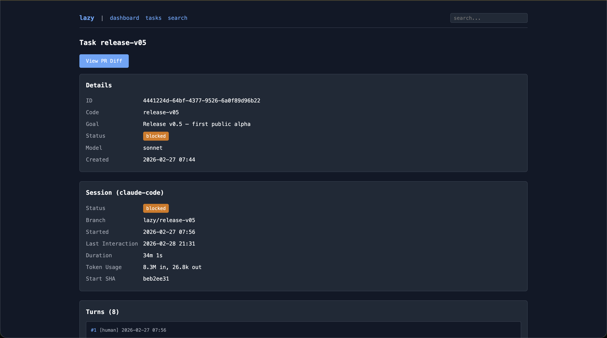

# `lazy`

`lazy` is:

* A secure, locally hosted agent [orchestrator](#the-orchestrator): `lazy` is both a software development lead (`builder` mode) and a fleet of autonomous agents working on your behalf, concurrently and asynchronously.
* A [proxy](#the-proxy) for AI-human collaboration: `lazy` captures conversations, reviews, and decisions in a searchable data store, under your control and giving both you and your agents improved situational awareness.
* An [software development lifecycle](#the-task-manager) tool integrating `git`: `lazy` treats the task -> work -> review -> acceptance/rejection cycle as a first-class development abstraction implemented through `git`. The same way the proxy wraps coding assistants and you don't invoke them directly, `lazy` removes the need to directly interact with `git`.

`lazy` is thus [my](https://github.com/ierceg) attempt to raise the abstraction on three different fronts at the same time:

* **Agents**: rather than working interactively with *coding* agents, `lazy` offers a way to work asynchronously with them *and* interactively with the intelligent orchestrator which is *also* aware of the prompts repository *and* task management features.
* **Prompts**: rather than throwing them away, `lazy` captures them so that both humans and agents can reference them and learn from them.
* **Source control**: rather than dealing with low-level pinnings of `git`, `lazy` wraps these mechanics into a task lifecycle management.

## What are the main benefits

* Prolonged autonomous horizon for agents (hours not tens of minutes)
* Autonomous, concurrent, asynchronous (turn based) work across multiple tasks
* Increased agent situational awarness (agents can search over all past tasks and prompts)

## Quick Start

```bash
# Initialize lazy in your git repository. This will detect the remote repository
# and other things like different runners (e.g. is there Docker)
cd your-hello-lazy-project/
lazy init

# Launch the agent in interactive mode with an additional lazy's system prompt
# and tell it what tasks to create and start.
lazy builder # Ask it "what can you do?"

# To review all the prompts that `lazy` uses run `lazy system prompts`
# To view the content of individual prompts use `lazy view <prompt-code>`

# Or create tasks directly
lazy create --code add-auth --goal "Add user authentication" --prompt "Use JWT tokens, bcrypt for passwords"
lazy start <task-id>

# Review the agent's work while chatting with agent itself
lazy review -i <task-id>

# On a rare (and they truly *ought* to be rare) occasion you may need to pair directly
# with the agent, use `lazy pair` to the agent's session but now with you in control
lazy pair <task-id>

# Accept and merge to main
lazy accept <task-id>

# Or reject if it's not right
lazy reject <task-id> --reason "Needs to use sessions instead of JWT"
```

## Core components

When you build `lazy`, you get a single executable. This executable will include in itself `lazy-agent` a linux build of `lazy` with a different CLI commands that run inside of Docker containers. The agent binary is mounted into Docker containers at runtime. Those are the two core components.

When you run `lazy` inside of a `lazy` initialized project, it will start running as daemon. Daemon is project aware and there is a single daemon running for the project. Daemon runs task reconiciliation, CI checks, PR comment harvesting and so on in the background and is the beating heart of the system. `lazy` was originally built just as CLI but later it became obvious to me that it needed a component that actively listens to events so I took a page from `tmux` book. You can check deamon state through `lazy daemon` commands.

Also, whenever you rebuild `lazy`, you need to run `lazy upgrade` to rebuild the `lazy` Docker image for your toolchain and upgrade daemon. Same as with deamon this upgrade will be per project.

## Core Concepts

* Agents do the coding and (most of) reviewing, you focus on the product, the architecture and giving guidance to unblock the agents.
* Your time is precious, agent time is aplenty. This permeates all interactions with `lazy` including direct conversations. Watching agents write code and yanking them when they go astray is *micromanagement*.
* Prompts and their context are valuable, code is a byproduct. `lazy` automatically keeps track of all conversations, prompts, turns, comments, feedbacks.
* Primary interface is the conversation - let `lazy`'s `builder` be your team lead - but you always have `lazy`'s deterministic tools at your disposal.
* Software development lifecycle is not an afterthought - it's front and center of `lazy` way of building software.

## Project Status

`lazy` is **alpha software** under active development. The core workflow is stable, but:

- I make no guarantees to its quality, correctness or safety
- Breaking changes may occur in storage schema or CLI interface
- Some (maybe even most) features are experimental
- Error messages are improving but may be cryptic

`lazy` is definitely not in an awesome shape, its tests fail, it's inconsistent, etc. but it's very, very fun to use. At least for me!

### Contributing

`lazy` is being actively developed. You can contribute by:

- Sending me feedback at [feedback@getlazy.dev](feedback@getlazy.dev)
- Reporting [bugs or feature](https://github.com/getlazy/lazy/issues) requests
- Submitting [**Prompt** Requests](https://github.com/getlazy/lazy/issues) for fixes or enhancements.
- Testing experimental features - if you are interested, send me an email to [testing@getlazy.dev](testing@getlazy.dev)

`lazy` is built using `lazy` itself. At this time, I am not accepting code contributions to its code base, which is why "Pull Requests" is not even offered.

## FAQ

### Why build `lazy`?

On one hand I felt that by throwing away prompts, we are not raising the abstraction of software development. I feel that that is akin to writing in a higher level language, compiling that to machine or p-code, then committing *that* code and deleting the original source code. It's not *exactly* the same of course but it is... akin.

On the other hand, I was tired of "pair programming" with coding assistants but felt that current tooling was not optimal for what I was trying to do. I don't want to chat with agents and become a blocker. Instead, I want to give them actionable feedback, asynchronously, on my own good time, and let them do their thing in the meantime.

For the record, I see a lot of people building and running their own orchestration layer and I think it's great. I expected this and I'm certainly not part of the 1st wave but more of "fine, I'll do it myself" wave. I expect this trend to continue leading to fragmentation the like of which we have not see since Linux distro ecosystem bloom.

### Why name it `lazy`?

Two reasons:

1. It's a nod to the original `lazy` project, the Hackable Coding Assistant that I built with my friend [neboysa](https://github.com/neboysa) back in 2016 to 2017. You can find it at [github.com/getlazy/lazy-og](https://github.com/getlazy/lazy-og)
2. This quote from [Robert A. Heinlein](https://en.wikipedia.org/wiki/Robert_A._Heinlein) (in spite of me being an early riser!):

> Progress doesn't come from early risers—progress is made by lazy men looking for easier ways to do things.

*Time Enough for Love (p. 54)*

`lazy` is my easier way of building software in the agentic age. I didn't like what I saw out there and I felt that it had to be built in a certain way, maybe idiosyncratic to me. To [paraphrase](https://en.wikipedia.org/wiki/Rifleman%27s_Creed):

> This is my way of building software. There are many like it, but this one is mine.

I hope you get as much fun from this (or more!) as I have.

### Why Not Just Use <X>?

See above. Plus building building `lazy` is fun, building with `lazy` is fun and building `lazy` with `lazy` is *extra* fun. Occasionally it is also *extra* frustrating but hey, what is programming if not a perpetual act of [frustration](https://x.com/CodeWisdom/status/1452004401774739464).

### At what is `lazy` particularly good at compared to native Claude Code?

From the point of view of the quality of one-shot code or similar - nothing whatsoever. From the point of view of experience of software development, where Claude Code aptly leverages subagents to launch work in the background, `lazy` uses its task system to do the same. `lazy` plans the work and fires off tasks and then gives *you* the control to do something else while the task or tasks are running. The difference, to me, is similar to the difference between real-time strategy games, where your reflexes dominate the outcome (how many times *today* have you slammed ESC to stop Claude Code going off the rails?), to turn-based strategy games, where you asynchronously plan and make your moves and then let the opponent take its turn. To me, it is liberating to review after the agent's turn, instead of watching reams of text fly by, hoping to gain some semblance of control.

Beside that, `lazy` does a lot of little "quality of life" things that are otherwise annoying with agents:

* Before agent's turn `lazy` inject goals of the task into the prompt, in order to avoid goal drift and stabilize the agent's output.
* Before agent's turn `lazy` automatically merges task's branch with origin branch and parent task's branch (e.g. main) so that the differences are never too large. Conflicts are resolved by the agents with a specially crafted prompt.
* After agent's turn `lazy` checks agent's work for file permission violations in order to make potential reward hacking (e.g. deleting tests it doesn't "like") obvious and rejectable by default.
* `lazy` has specific verbs and specialized prompts for different types of tasks, similar to skills but that go well beyond that. For example, there is a built-in `redo` command which acts like smart rebase redoing the work already done, from scratch, on top of latest HEAD, repeating the exact same goal and prompt.

### At what is `lazy` particularly bad at?

Originally, it was really annoying when I would be preparing a new release and I doing a lot of integration tests. This polishing would expose a number of smaller issues which in stable state are fine to fire off as small tasks but when you are trying to release, it becomes too heavy handed. The whole thing that makes `lazy` great to use in normal process, is what makes it not great to use when you have a number of very small issues that need more interactive polishing. But now you can use `lazy pair` without task ID, right on the branch that you want to modify (e.g. `release-v011`) and with it can go back to working in the traditional "micro-management" style which feels exactly right for small, last minute polishing tasks.

Another thing that is annoying are bootstrapping failures: `lazy` failing so hard that I cannot fix it using `lazy`. But that is very rare these days and besides, it's only annoying to me.

### Why use Docker?

I want to make the default onboarding path both safe and easy and I think docker is well established in the software development. Docker is not universally loved but it pretty much universally **used**. And it gave me one crucial thing: agents are isolated from the host's file system which minimizes the chances of catastropic consequences of prompt injections. *They* could of course be prompt injected, they have access to the network after all and run autonmously. But the only way for them to affect your host machine is by injecting behavior into the code which you then blindly run on your box. By adding `builder` layer, which also runs isolated, as the first reviewer, I again lowered the chances of such attacks passing through. This doesn't eliminate them but I don't see how to eliminate that short of stopping to use LLMs to write code.

## The Details

### The proxy

`lazy` is a thin proxy that sits between you and AI coding agents, managing tasks as bounded units of work with full conversation history:

- Captures conversations between you and the builder, the agentic team lead
- Captures interactions (prompts, comments, feedback) in a searchable data store that agents themselves query during their work for improved situational awareness
- Enables search, for both you and all agents, across all task conversations, prompts, turns, and comments

### The orchestrator

AKA "the `builder`".

- Interact with the `builder` agent directly through conversations and let it interact with agents through turn by turn feedback *OR*
- Use deterministic CLI tools for that task and work management including agent feedback
- Or do both at the same time!

All `builder` and autonomous agent sessions run in isolated containers with only the repo being mounted on them. Each tasks is also isolated in its own worktree and `git` branch.

The process isolation is necessary as `lazy` runs **autonomous** agents which means that they are exposed to prompt injection risk. Furthermore, the `builder` agent, which while running interactively is not as exposed (you have to give it permissions to read things from the net), reviews summaries and code written by the autonomous agents which means that, through that channel, it is **also** exposed to prompt injections. The only entity *not* exposed to the prompt injection is the user. Hence it is the user that finally **must** accept the source code - after adequate reviews. I **strongly** encourage using deterministic security tools and review agents for the code written in this way.

The current mechanism for this isolation is [Docker](https://docker.com). Docker is a lousy choice for *development* but it's easy to isolate. Alternative is to run `lazy` on its own VM and direct processes mode - but this is still highly experimental. I **strongly** discourage running `lazy` on the host in direct process mode as each agent runs fully autonomously and is therefore susceptible to prompt injections.

### The task manager

- Create tasks with explicit goals and prompts for agents, track them through turns, accept or reject them
- Assemble tasks into larger coherent wholes (features, releases) and hierarchies (tasks -> features -> releases -> main)
- Sync with remote repos for PR creation, comment syncing, and remote collaboration (GitHub and GitLab support)

The feel is one of task-aware `git`. For example, if an agent is working on a task and you accept its sub-task, `lazy` will refuse to merge until the parent task has finished running. Also, on every agent turn, the first thing that is done is syncing with upstream (parent's branch) and resolving conflicts. This can sometimes lead to suboptimal results but the sooner the conflicts are resolved the better it is. And in case the task is really falling behind its parent, then you can always run `lazy redo` to redo the task from scratch (from parent's current HEAD). This is in a way `rebase` powered by LLMs.

## Prerequisites

- **Claude Code** - `lazy` wraps Claude Code (install from [code.claude.com](https://code.claude.com/docs/en/setup)) (more agents coming!)
- **Bun** — `lazy` is built on Bun (install from [bun.sh](https://bun.sh))
- **Docker** — Agents run in isolated containers (install from [docker.com](https://docker.com))
- **Git** — Required for version control and worktree management

For remote repo integration:

- **GitHub CLI** (`gh`) (`brew install gh` or see [cli.github.com](https://cli.github.com))
- **GitLab CLI** (`glab`) (`brew install glab` or see [docs.gitlab.com](https://docs.gitlab.com/cli/))

## Installation

### Build from Source

```bash
# Clone the repository
git clone https://github.com/getlazy/lazy.git
cd lazy

# Install dependencies and build
bun install
bun run build

# Install to ~/.lazy/bin/
mkdir -p ~/.lazy/bin
mv lazy ~/.lazy/bin/
mv lazy-agent ~/.lazy/bin/

# Or simply run `bun run install:local` to do both ^^

# Add to PATH and set completions
echo 'export PATH="$HOME/.lazy/bin:$PATH"' >> ~/.bashrc  # or ~/.zshrc
echo 'eval "$(lazy completion --zsh)"' >> ~/.bashrc  # or ~/.zshrc
source ~/.bashrc # or rather obviously ~/.zshrc
```

`lazy` is the CLI you interact with while the `lazy-agent` is the entrypoint that runs inside Docker containers and which in turn invokes the agent.

Verify installation:

```bash
lazy --version
```

### Authentication Setup

`lazy` wraps around Claude Code which requires that you setup its OAuth token as envvar. `lazy` does not store or otherwise capture this information - it just passes it along so that Claude Code can read it.

```bash
# Option 1: Anthropic API key
export ANTHROPIC_API_KEY="your-key-here"

# Option 2: Claude Code OAuth token
claude setup-token
# Then set CLAUDE_CODE_OAUTH_TOKEN
```

For GitHub integration (optional):

```bash
gh auth login
```

For GitLab integration (optional):

```bash
glab auth login
```

## Real-World Configurations

What follows are recommendations for real-world configurations.

### Host development

If developing on host, I **strongly** encourage leaving the default docker runner. It is built for this use case where its necessary to isolate autonomous agents from the host system. When running in docker, the agents only have access to repo itself and network (by default - though that can be turned off) and nothing else.

```
[runner]
type = "docker"
```

Or just leave out the configuration of the runner - it's docker by default.

### VM development

If you have complex dependencies or environment requirements, I recommend developing in an isolated VM, which doesn't have anything but the repo and your development environment. I **strongly** recommend creating a specifically crafted token for remote repositories to minimize any dangers of possible prompt injections affecting remote repositories.

If all of the above is true, then yes, with trepidation, you can use:

```
[runner]
type = "dangerously-host-process-without-any-isolation"
```

The name says it all - you really **ought** to **never** run like that unless in an isolated environment.

Regarding VM, there is one more thing that you will likely want to do which is to configure a different `lazy.toml` file to be used inside of VM. This is useful if you sometimes work in the VM and sometimes on the host or if there is a difference the way team mates work. To make use of that, override `LAZY_CONFIG` envvar inside of the VM to point to the alternative lazy.toml. For example, in this repo you will find `lazy.lima.toml` which uses this technique to pass the correct **VM** configuration which has the host runners unlike the host lima configuration which uses docker runners.

### Storage Location

By default, `lazy` stores task data in `~/.lazy/<project-name>/`. You can customize this location by setting `storage.external_path` in `lazy.toml` to store data elsewhere — useful for backups or storing in a separate repository for safekeeping.

## Details

### `lazy builer`

An interactive session with Claude Code with the addition of `lazy`'s own system prompt, guiding the conversation toward task creation, orchestration and reviewing. Work with `builder` to:

- Ideate, plan work, create new tasks.
- Start tasks and keep track of their progress.
- Review tasks and give them feedback.
- Schedule task acceptance trains.
- Decide on priorities and directions.

In `builder` mode, the assistant is strongly encouraged to *not* do anything itself but rather to create tasks and coordinate work of agents working on those tasks. It is actually *so* discouraged that I mount the repo as read-only into `builder`'s container.

The user <-> `builder` <-> agent relationship follows a clear division of labor:

- The **user** sets direction and make decisions, plan larger work ("release so and so will have features this and that")
- The **`builder`** helps scope work and manage tasks with goals and prompts, and preliminary or full feedback to the agents
- The **agents** write code

Again, the `builder` never touches code directly — it creates tasks with goals and prompts, starts agents, and reviews their output. Think of it as working with a tech lead who delegates to a team of engineers.

The typical workflow:

- You tell the `builder` what you want and you chat about it a bit
- `builder` offers to create certain tasks, and then starts them thus launching agents
- Agents work in autonomously and in parallel until they finish or need guidance, and `builder` and you review the results.
- You either accept or provide feedback at which point agents continue their work.

Use `lazy blocked` to see what's ready for review, and `lazy loop` to review everything in sequence. Or ask the `builder` to wait for the tasks and let you know what it thinks of the work.

### Agents

Agents work in isolation — each runs in its own Docker container with a dedicated `git` worktree. They can search past task history via MCP tools to understand prior decisions, but they don't coordinate with each other directly. The `builder` handles sequencing, conflict avoidance, and priority decisions.

Agents are harnessed into a deterministic turn lifecycle. On every turn, the agents will:

* Merge upstream changes (changes on the branch of the parent task) and resolve conflicts
* Work on the prompt as they see fit, fully autonomously, committing as they go along
* Stop their turn by leaving the summary of their work

### Task

A unit of work consists of a **goal** (one-line description) and **prompt** (detailed instructions). Tasks have lifecycle states:

- `backlog` — Created but not yet started
- `working` — Agent actively working
- `blocked` — Waiting for human review/feedback
- `pairing` — Human collaborating in `lazy pair` mode
- `interrupted` — Container crashed or was stopped
- `complete` — Accepted and merged
- `abandoned` — Rejected and closed
- `closed` — Closed without work (cancelled)

Tasks can have child tasks (created via branching or proposals) for exploring alternatives or follow-up work. These child tasks naturally merge into parent's branch.

#### Task Lifecycle Flow

The happy path for a task:

```
backlog ──→ working ──→ blocked  ──→ complete
            (agent)     (review)     (merged)
```

With feedback iterations:

```
blocked    ──→ working ──→ blocked ──→ ... ──→ complete
(feedback)     (agent)     (review)            (merged)
```

And of course - you can do [review](#review) or you can work with [`builder`](#builder) on it.

### Turn

A single message in the conversation—either from the human or the agent. Each turn records:

- Role (`human` or `agent`)
- Content (the message text)
- Token usage (input/output/cache tokens)
- `git` SHAs before/after the turn
- Model used (sticky: next turn inherits if not overridden - feel free to increase it or lower it)

Turns are the primary way to keep track of *why* the code was changed.

### Review

Human feedback on a task though often written by `lazy builder`. Reviews capture:

- Verdict (`approve`, `reject`, `request_changes`)
- Rationale (free-text explanation)
- Reviewer and timestamp

Reviews create a permanent record of human decisions, making the review history searchable for future reference.

### Interactive review

For smaller tasks, builder's review is fine, but it often involves back and forth between you and builder and without agent's insight into *exactly* why it has or hasn't done something. In those circumstances I vastly prefer interactive review which keeps the agent in read-only mode but allows asking questions and getting quick answers (as it works in low effort mode).

```
lazy review -i <task-id>
```

This allows you to read the agent's summary of the last turn, ask questions about parts of it (by splitting hunks similar to the way `git add -p` does) and provide direct feedback to the agent that it should take on the next turn.

## Key Commands

Just run `lazy` and go through the commands. Or run `lazy builder` and skip learning the CLI incantations until you need them.

## Configuration

Configuration lives in `lazy.toml` at the repository root. Created by `lazy init` with defaults.

### Example Configuration

See [`lazy.toml.exammple`](./lazy.toml.example)

Run `lazy doctor` to validate your configuration.

## Advanced Features

### Collaborative Pairing

```bash
lazy pair [<task-id>]
```

Launches an interactive Claude Code session in the task's worktree **on the host**. You drive the conversation directly—asking Claude to make changes, running tests, editing code together. When you exit, `lazy` captures new commits and a summary as a turn. Useful for:

- Debugging issues the agent can't resolve
- Showing the agent how to do something by example
- Taking over when the agent is stuck
- Lots of little polishing tasks where you need short loop

This is rarely needed as you usually want to unblock with review and move on. But when it's needed, it's a great escape hatch.

#### Taskless pairing

As I mentioned before, when you are working on a set of very, very small tasks, the turn based "lazy-ness" is... not great. At those times you are doing a lot of back and forth and you don't want to just delegate: you want to be hands-on. For those moments, `lazy pair` can be invoked without any task ID, right on the branch that you want to be modifying, and it will start a new conversation that will be captured, just like any other `lazy` conversation, but without any task to anchor on.

### Confirmation Protocol

Agents can be wild in their actions and autonomous agents only more so which is why `lazy` adds additional friction when `builder` is taking system level actions. `lazy`'s `builder` works on the project level and its errors can propagate through both the software being built (e.g. insufficiently careful reviews) and to the *process* of the software building through `lazy` itself (e.g. rejecting long running tasks on its own where another turn would do the trick). Hence `lazy` has a built-in confirmation "tell me twice" protocol that escalates the feedback to the `builder` itself forcing it (or at least *sternly* suggesting) to take additional actions before continuing with the operation. For example, when accepting a large task, `lazy` will demand that `builder` performs a review first and only if it's still confident, accept the task This push back gives the `builder` a 2nd chance to "reflect" on the action rather than you having to carefully and synchronously curate what actions are allowed at what time.

A broader point to be made here is that humans and agents require different UI because they make different mistakes. For example, there is no push back on CLI commands because those are meant for humans and humans don't just shoot from the hip and say reject tasks instead of giving feedback. But agents do so MCP is tighter UI than CLI. Another example is `lazy start` which allows humans to immediately create and launch tasks but `lazy_start` MCP tool does not allow that because agents have a tendency to create a task and then try to fix its parent and similar things that cannot be done once the task has started. Hence "tight MCP, lax CLI" is a good rule of thumb.

#### Details

There are four levels of "tell me twice":

* `none`: `lazy` does not requires confirmation
* `light`: `builder` is reminded of the effect of the changes but nothing else
* `standard`: `builder` is told what it needs to do before accepting the diff
* `stern`: `builder` is told, in sterner terms, to perform the review and "reflect" before accepting the diff

Conditions for triggering these levels depend on the action being performed. For `accept` which is *the* riskiest operation, because after all, it affects the system under development, confirmations are triggered under the following conditions:

| Condition (evaluated in order) | Level |
|-------------------------------|-------|
| Total lines ≤ 20 **and** files changed ≤ 2 | `none` |
| Total lines > 500 **or** files changed > 10 | `stern` |
| Total lines > 100 **or** files changed > 5 | `standard` |
| Otherwise | `light` |

### Minimization of Little Differences

On every turn, before the agent has a chance to act on the prompt, `lazy` does two things:

* It tries to merge the origin branch into the local task's branch and
* It tries to merge the parent's origin branch into the task's branch

In both cases, if there are conflicts, it invokes the agent with a specific prompt of resolving the conflicts and giving the origin's state advantage over own's state (under the assumptions that those changes have been freshly accepted whereas agent is still working on the current task). This allows you to minimize the divergence between two sources of changes: task's origin branch where *other* actors may have pushed their changes since agent's last turn and parent's origin branch where other tasks may have been accepted since agent's last turn.

### File Permission

After every agent's turn, `lazy` will check if the agent has tried to change or delete files from the areas that are prohibited for it to touch. For me, there are two areas that I don't want agents just screwing around: this `README.md` and the tests. I got tired of agents, not only `lazy` agents but in general, "fixing" the issues by deleting or unnecessarily modifying tests. So now `lazy` is enforcing the rules, not through begging and cajoling in prompts but with a deterministic process.

That said, many times changes to say tests are really are needed, so `lazy` doesn't outright prohibit the changes but rather detects the violations and exposes them to you and `lazy builder` agent. Then it is up to the reviewer, whatever it may be, to *explicitly* accept chagnes to files. What is not accepted is assumed rejected and on the next turn, before it tries to merge anything or give the agent control, `lazy` will revert the rejected files to their pre-last-turn state and let the agent know about the changes.

### Head of Line Blocking

As [Herb Sutter](https://herbsutter.com/) memorably put it in his 2009 [Sharing Is the Root of All Contention](https://www.state-machine.com/doc/Sutter2009a.pdf):

> Sharing requires waiting and overhead, and is a natural enemy of scalability

Amen. He was (mostly) talking about runtime concurrency of a software system but concurrency in the process of a software engineer team has the same shape: different agents share the same resource, repository, and they must contend with each other to update the release branch in order to release their changes. `lazy` tries to deal with this by allowing working trains, where feature branches are branched off other feature branches that are still in flight, and so on, so that the changes can propagate with minimal differences throughout the code base. This is all happening without you paying attention to it, because the system moves forward together on every turn. And if you prefer *not* to do it that way, you simply branch of new features off the default branch and the upstream will be merged into the feature when you give the feature's main task another turn.

### Shell

To shell into the task's worktree just run:

```bash
lazy shell task-id
```

Note that in this case you will be shelling into the worktree on the **host** and not the agent's container. Same as `pair` this is an escape hatch for any issues with Docker: here you can build and run everything with your host tooling.

### Remote Syncing

```bash
lazy sync
```

Creates MRs or PRs for tasks, syncs comments as turn context, and updates status based on `lazy` task state. Two-way sync: comments on your remote repository appear in `lazy`, and `lazy` reviews appear in the remote repository. Merge is done by approving MRs/PRs and then synchronizing.

For more details:

```bash
lazy sync --help
```

### Remote Integration and Merge Lifecycle

`lazy` integrates with GitHub and GitLab for PR/MR-based workflows. Configure the driver in `lazy.toml`:

```toml
[remote]
driver = "github"  # or "gitlab" or "local"
```

If CI checks are pending at accept time, the task enters `merging` state and completes automatically when checks pass.

Comment sync brings PR/MR review comments into the agent's context, so external reviewers can give feedback that the agent sees on its next turn.

#### Supported Drivers

| Driver | Merge strategy | PR/MR | Comment sync | CI integration | CLI required |
|--------|---------------|-------|--------------|----------------|--------------|
| `local` | Squash merge (local `git`) | None | None | None | — |
| `github` | Squash merge (GitHub API) | Draft PR → ready | PR comments ↔ agent turns | GitHub Actions | `gh` |
| `gitlab` | Squash merge (GitLab API) | MR on first turn | MR notes ↔ agent turns | GitLab CI | `glab` |

Run `lazy doctor` to verify your driver setup and authentication.

### Search and Context Retrieval

```bash
lazy search "error handling"
```

Searches all tasks, turns, commits, comments, and imported conversations. Agents use `lazy_search` to find rationale from past work when making decisions.

```bash
lazy search "code:a-task"
```

Searches for all the tasks with `a-task` code. Codes are not unique so lazy will offer to disambiguate.

For more details:

```bash
lazy search --help
```

### Upgrading

When you build a new version of `lazy`, you have to replace the instances running in containers as well as the deamon. To do so run:

```bash
lazy upgrade
```

It will warn you if any of the agents is working on a task.

### Waiting on a Task

When you want to wait for a task (e.g. to review it or to run upgrade) you run:

```bash
lazy wait task-id
```

If you want to wait for the next task to finish just run:

```bash
lazy wait --next
```

If you want to wait for a task out of a group of tasks to finish:

```bash
lazy wait task-1 task-2 task-n # First to finish will stop this
```

### Web Interface

`lazy` has read-only, highly experimental, not anywhere near mature, web interface. To see run:

```bash
lazy server
```

The command will indicate the port on which it is running.

It looks like this:



### Task Types

Use task types to signal intent and get automatic methodology constraints:

```bash
lazy fix --goal "..."       # Evidence-driven debugging: reproduce first, then fix
lazy refactor --goal "..."  # Behavior-preserving: one step per commit, tests after each
lazy document --goal "..."  # Read-only for code, writes docs only
```

Other types (`spike`, `test`, `audit`, `migrate`, `tidy`, `feature`, `release`) are metadata signals — set with `--type`:

```bash
lazy create --goal "Evaluate caching options" --type spike
```

Not all task types have specialized prompts but I am working on them.

### Working with Context

- **Use task codes** — `fix-token-hang` is self-documenting in `lazy list`. Use descriptive kebab-case codes, not hex IDs.
- **Reference prior work** — "Check the `add-auth` task and follow the same pattern" beats re-explaining everything.
- **Search before creating** — `lazy search "auth"` finds existing tasks, conversations, and decisions.
- **Prefer feedback over rejection** — feedback preserves conversation history and lets the agent iterate. You usually don't want to reject until the approach is fundamentally wrong or the task has been superseded by another task.

## Troubleshooting

### "lazy: command not found"

Ensure `~/.lazy/bin/` is in your PATH:

```bash
export PATH="$HOME/.lazy/bin:$PATH"
```

### "Docker daemon not running"

Start Docker:

```bash
# macOS
open -a Docker

# Linux (systemd)
sudo systemctl start docker
```

### Custom Dockerfile says "image not found: lazy-runner"

If your project's `Dockerfile.lazy` starts with `FROM lazy-runner`, the base
runner image must already exist locally. On a fresh machine it doesn't yet —
prebuild it explicitly:

```bash
lazy system build lazy-runner
```

This bypasses the current project's `lazy.toml` and builds the base image
directly. Add `--no-cache` to force a clean rebuild.

### "ANTHROPIC_API_KEY not set"

Export your API key:

```bash
export ANTHROPIC_API_KEY="your-key-here"
```

### "Authentication required"

`lazy` requires one of these environment variables:

```bash
# Option 1: Anthropic API key
export ANTHROPIC_API_KEY="your-key-here"

# Option 2: Claude Code OAuth token
claude setup-token
# Then set CLAUDE_CODE_OAUTH_TOKEN
```

### Task stuck in "working" state

If a container crashes or is killed, the task may show as `working`. Use:

```bash
lazy resume <task-id>
```

Unless the container has been deleted, `lazy` will resume the agent's session.

Or check status and manually reconcile:

```bash
lazy status <task-id>
lazy doctor  # Checks for stale containers
```

### Merge conflicts during accept

If main has advanced since the task started:

```bash
lazy diff <task-id>  # Review conflicts
lazy shell <task-id>  # Manually resolve in worktree
# Make commits to resolve conflicts, then:
lazy accept <task-id>
```

Or reject and redo on current main:

```bash
lazy redo <task-id>
```

Coding is cheap, prompts are valuable, this will inject the original prompt plus as many turns as it can fit into the redo task's prompt.

## Support

- **Self-diagnosis**: Run `lazy doctor` to check installation, authentication, Docker, and driver configuration
- **Command help**: `lazy <command> --help` for usage details
- **System prompts**: `lazy system prompts` to see what instructions agents receive
- **Prebuild base image**: `lazy system build lazy-runner` for projects whose `Dockerfile.lazy` uses `FROM lazy-runner`
- **Issues**: Report bugs at [github.com/getlazy/lazy/issues](https://github.com/getlazy/lazy/issues)

## Links

- **Repository**: [github.com/getlazy/lazy](https://github.com/getlazy/lazy)
- **Issues**: [github.com/getlazy/lazy/issues](https://github.com/getlazy/lazy/issues)
- **Claude Code**: [claude.ai/claude-code](https://claude.ai/claude-code)
