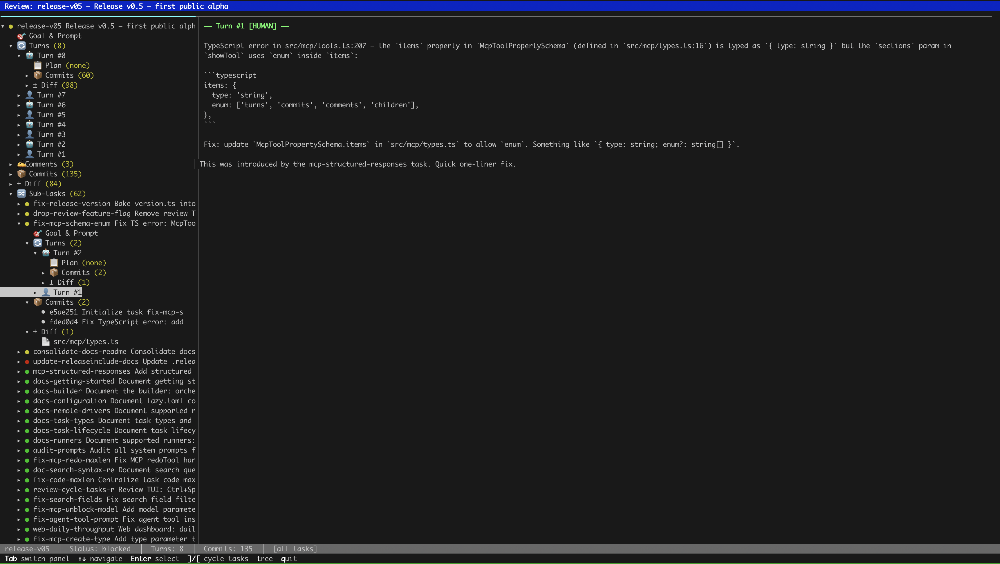

# Lazy

Lazy is three things:

* A [proxy](#the-proxy) for AI-human collaboration: Lazy captures conversations, reviews, and decisions in a searchable data store, under your control.
* A secure, locally hosted agent [orchestrator](#the-orchestrator): Lazy is at the same time a software development lead (aka builder) and a fleet of agents working on your behalf
* An integrated [software development lifecycle](#the-task-manager) tool. Lazy treats the task -> work -> review -> acceptance/rejection cycle as a first-class development abstraction rather than an afterthought.

## Core Concepts

* Your time is precious, agent time is aplenty. This permeates all interactions with lazy including direct conversations.
* Prompts and their context are valuable, code is a byproduct. Lazy keeps track of conversations, prompts, turns, comments, feedback.
* Agents do the coding and (most of) reviewing, you focus on the product, the architecture and giving guidance to unblock the agents.
* Primary interface is the conversation - let lazy's builder be your team lead - but you always have lazy's deterministic tools at your disposal.

## Project Status

Lazy is **alpha software** under active development. The core workflow is stable, but:

- Breaking changes may occur in storage schema or CLI interface
- Some (maybe even most) features are experimental (marked in `--help` output)
- Error messages are improving but may be cryptic
- I make no guarantees to its quality, correctness or safety

Lazy is definitely not in an awesome shape, it's test fail, it's inconsistent, etc. but it's very, very fun to use. At least for me!

### Contributing

Lazy is actively developed. Contributions welcome in the form of:

- Issues Report bugs or request features on GitLab
- **Prompt** Requests: Submit *prompts* for fixes or enhancements.

Lazy is built using lazy itself. At this time, I am not accepting code contributions to its code base.

## Motivations

### Why build this

On one hand I felt that by throwing away prompts, we are not raising the abstraction of software development. On the other hand, I was tired of "pair programming" with coding assistants but felt that current tooling was not optimal for what I was trying to do.

### Why "lazy"

Two reasons:

1. It's a nod to the original lazy project, the Hackable Coding Assistant that I built with my friend [neboysa](https://github.com/neboysa) back in 2016 to 2017. You can find it at [github.com/getlazy/lazy-og](https://github.com/getlazy/lazy-og)
2. This quote from [Robert A. Heinlein](https://en.wikipedia.org/wiki/Robert_A._Heinlein) (in spite of me being an early riser!):

> Progress doesn't come from early risers—progress is made by lazy men looking for easier ways to do things.

*Time Enough for Love (p. 54)*

Lazy is my easier way of building software in the agentic age. I didn't like what I saw out there and I felt that it had to be built in a certain way, maybe idiosyncratic to me. To [paraphrase](https://en.wikipedia.org/wiki/Rifleman%27s_Creed):

> This is my way of building software. There are many like it, but this one is mine.

I hope you get as much fun from this (or more!) as I have.

### Why Not Just Use X

See above. Plus building lazy is fun and building lazy with lazy is *extra* fun.

## The Details

### The proxy

Lazy is a thin proxy that sits between you and AI coding agents, managing tasks as bounded units of work with full conversation history:

- Captures conversations between you and the builder, the agentic team lead
- Captures interactions (prompts, comments, feedback) in a searchable data store that agents themselves query during their work for improved situational awareness
- Enables search, for both you and all agents, across all task conversations, prompts, turns, and comments

### The orchestrator

- Interact with the builder agent directly through conversations and let it interact with agents through turn by turn feedback *OR*
- Use deterministic CLI tools for that task and work management including agent feedback
- Or do both at the same time!

All builder and agent sessions run in isolated containers with only the repo being mounted on them. Each tasks gets its own worktree and branch as a sandbox.

The mechanism for isolation is [Docker](https://docker.com). Docker is a lousy choice for *development*  but it's easy to isolate. Alternative is to run lazy on its own VM and direct processes mode - but this is still highly experimental. I **strongly discourage** running lazy on the host in direct process mode as each agent runs fully autonomously and is therefore susceptible to prompt injections.

### The task manager

- Create tasks with explicit goals and prompts for agents, track them through turns, accept or reject them
- Assemble tasks into larger coherent wholes (features, releases) and hierarchies (tasks -> features -> releases -> main)
- Sync with remote repos for PR creation, comment syncing, and remote collaboration (GitHub and GitLab support)

## Prerequisites

- **Claude Code** - Lazy wraps Claude Code (install from [code.claude.com](https://code.claude.com/docs/en/setup)) (more agents coming!)
- **Bun** — Lazy is built on Bun (install from [bun.sh](https://bun.sh))
- **Docker** — Agents run in isolated containers (install from [docker.com](https://docker.com))
- **Git** — Required for version control and worktree management

For remote repo integration:

- **GitLab CLI** (`glab`) (`brew install glab` or see [docs.gitlab.com](https://docs.gitlab.com/cli/))
- **GitHub CLI** (`gh`) (`brew install gh` or see [cli.github.com](https://cli.github.com))

## Installation

### Build from Source

```bash
# Clone the repository
git clone https://gitlab.com/getlazy/lazy.git
cd lazy

# Install dependencies and build
bun install
bun run build

# Install to ~/.lazy/bin/
mkdir -p ~/.lazy/bin
mv lazy ~/.lazy/bin/
mv lazy-agent ~/.lazy/bin/

# Or simply run `bun run install:local` to do both ^^

# Add to PATH and set completions
echo 'export PATH="$HOME/.lazy/bin:$PATH"' >> ~/.bashrc  # or ~/.zshrc
echo 'eval "$(lazy completion --zsh)"' >> ~/.bashrc  # or ~/.zshrc
source ~/.bashrc # or rather obviously ~/.zshrc
```

`lazy` is the CLI you interact with while the `lazy-agent` is the entrypoint that runs inside Docker containers and which in turn invokes the agent.

Verify installation:

```bash
lazy --version
```

### Authentication Setup

Lazy wraps around Claude Code which requires that you setup its OAuth token as envvar. Lazy does not store or otherwise capture this information - it just passes it along so that Claude Code can read it.

```bash
# Option 1: Anthropic API key
export ANTHROPIC_API_KEY="your-key-here"

# Option 2: Claude Code OAuth token
claude setup-token
# Then set CLAUDE_CODE_OAUTH_TOKEN
```

For GitLab integration (optional):

```bash
glab auth login
```

For GitHub integration (optional):

```bash
gh auth login
```

## Quick Start

```bash
# Initialize lazy in your git repository
cd your-project/
lazy init

# Launch the agent in interactive mode with an additional Lazy's system prompt
# and tell it what tasks to create and start.
# To review all the prompts that Lazy uses run `lazy system prompts`
# To view the content of individual prompts use `lazy view prompt-code`
lazy builder

# Or create tasks directly
lazy create --code add-auth --goal "Add user authentication" --prompt "Use JWT tokens, bcrypt for passwords"
lazy start <task-id>

# Review the agent's work in a full-screen TUI
lazy review <task-id>

# On a rare (and they truly *ought* to be rare) occasion you may need to pair directly
# with the agent, use `lazy pair` to the agent's session but now with you in control
lazy pair <task-id>

# Accept and merge to main
lazy accept <task-id>

# Or reject if it's not right
lazy reject <task-id> --reason "Needs to use sessions instead of JWT"
```

## Details

### Builder

An interactive session with Claude Code with the addition of lazy's own system prompt, guiding the conversation toward task creation, orchestration and reviewing. Work with builder to:

- Ideate, plan work, create new tasks.
- Start tasks and keep track of their progress.
- Review tasks and give them feedback.
- Schedule task acceptance trains.
- Decide on priorities and directions.

In builder mode, the assistant is strongly encouraged to *not* do anything itself but rather to create tasks and coordinate work of agents working on those tasks. It is actually *so* discouraged that I mount the repo as read-only into builder's container.

The user <-> builder <-> agent relationship follows a clear division of labor:

- The **user** sets direction and make decisions, plan larger work ("release so and so will have features this and that")
- The **builder** helps scope work and manage tasks with goals and prompts, and preliminary or full feedback to the agents
- The **agents** write code

Again, the builder never touches code directly — it creates tasks with goals and prompts, starts agents, and reviews their output. Think of it as working with a tech lead who delegates to a team of engineers.

The typical workflow:

- You tell the builder what you want and you chat about it a bit
- Builder offers to create certain tasks, and then starts them thus launching agents
- Agents work in autonomously and in parallel until they finish or need guidance, and builder and you review the results.
- You either accept or provide feedback at which point agents continue their work.

Use `lazy blocked` to see what's ready for review, and `lazy loop` to review everything in sequence. Or ask the builder to wait for the tasks and let you know what it thinks of the work.

### Agents

Agents work in isolation — each runs in its own Docker container with a dedicated git worktree. They can search past task history via MCP tools to understand prior decisions, but they don't coordinate with each other directly. The builder handles sequencing, conflict avoidance, and priority decisions.

Agents are harnessed into a deterministic turn lifecycle. On every turn, the agents will:

* Merge upstream changes (changes on the branch of the parent task) and resolve conflicts
* Work on the prompt as they see fit, fully autonomously, committing as they go along
* Stop their turn by leaving the summary of their work

### Task

A unit of work consists of a **goal** (one-line description) and **prompt** (detailed instructions). Tasks have lifecycle states:

- `backlog` — Created but not yet started
- `working` — Agent actively working
- `blocked` — Waiting for human review/feedback
- `pairing` — Human collaborating in `lazy pair` mode
- `interrupted` — Container crashed or was stopped
- `complete` — Accepted and merged
- `abandoned` — Rejected and closed
- `closed` — Closed without work (cancelled)

Tasks can have child tasks (created via branching or proposals) for exploring alternatives or follow-up work. These child tasks naturally merge into parent's branch.

#### Task Lifecycle Flow

The happy path for a task:

```
backlog ──→ working ──→ blocked  ──→ complete
            (agent)     (review)     (merged)
```

With feedback iterations:

```
blocked    ──→ working ──→ blocked ──→ ... ──→ complete
(feedback)     (agent)     (review)            (merged)
```

And of course - you can do [review](#review) or you can work with [builder](#builder) on it.

### Turn

A single message in the conversation—either from the human or the agent. Each turn records:

- Role (`human` or `agent`)
- Content (the message text)
- Token usage (input/output/cache tokens)
- Git SHAs before/after the turn
- Model used (sticky: next turn inherits if not overridden - feel free to increase it or lower it)

Turns are the primary way to keep track of *why* the code was changed.

### Review

Human feedback on a task though often written by lazy builder. Reviews capture:

- Verdict (`approve`, `reject`, `request_changes`)
- Rationale (free-text explanation)
- Reviewer and timestamp

Reviews create a permanent record of human decisions, making the review history searchable for future reference.

## Key Commands

Just run `lazy` and go through the commands. Or run `lazy builder` and skip learning the CLI incantations until you need them.

## Configuration

Configuration lives in `lazy.toml` at the repository root. Created by `lazy init` with defaults.

### Example Configuration

```toml
[models]
# default = "sonnet"  # Options: "sonnet", "opus", "haiku" or leave it unset for builder to decide
# In each turn you can always upgrade or downgrade the agent that is working on the task

[storage]
backend = "orphan-branch"          # Options: "in-repo", "orphan-branch", "external"
orphan_branch_name = "lazy-state"  # Branch name for orphan-branch backend
# external_path = ""        # Path for external backend - can be a separate repo

[git]
default_branch_prefix = "lazy"  # Branch naming: lazy/task-code-with-disambiguation

[docker]
toolchain = ""  # Override auto-detected toolchain
# dockerfile = ""  # Path to custom Dockerfile
# Toolchain options: base, bun, node, deno, rust, go, cpp, ruby-rails,
#   ruby-rails-rust, dotnet, python, python-ml, java, kotlin, swift
# To list all toolchains run `lazy system toolchains`

[remote]
driver = "local"  # Options: "local", "github", "gitlab"
```

Run `lazy doctor` to validate your configuration.

## Advanced Features

### Collaborative Pairing

```bash
lazy pair <task-id>
```

Launches an interactive Claude Code session in the task's worktree. You drive the conversation directly—asking Claude to make changes, running tests, editing code together. When you exit, lazy captures new commits and a summary as a turn. Useful for:

- Debugging issues the agent can't resolve
- Showing the agent how to do something by example
- Taking over when the agent is stuck

This is rarely needed as you usually want to unblock with review and move on. But when it's needed, it's a great escape hatch.

### Shell

To shell into the task's worktree just run:

```bash
lazy shell task-id
```

Note that in this case you will be shelling into the worktree on the **host** and not the agent's container. Same as `pair` this is an escape hatch for any issues with Docker: here you can build and run everything with your host tooling.

### Continuous Review Loop

```bash
lazy loop
```

Iterates through all blocked tasks sequentially. For each task:
1. Shows context (goal, recent diff, comments)
2. Offers choices: give feedback, accept, reject, merge upstream, or skip
3. Moves to the next blocked task

It's very rudimentary but does the trick.

For more details:

```bash
lazy loop --help
```

### TUI Review

Of course lazy has TUI as well. To review a task and all its descendants, run:

```bash
lazy review task-id
```

It looks like this:



Just look at that design - feels like DOS days again!

### Remote Syncing

```bash
lazy sync
```

Creates MRs or PRs for tasks, syncs comments as turn context, and updates status based on lazy task state. Two-way sync: comments on your remote repository appear in lazy, and lazy reviews appear in the remote repository. Merge is done by approving MRs/PRs and then synchronizing.

For more details:

```bash
lazy sync --help
```

### Remote Integration and Merge Lifecycle

Lazy integrates with GitHub and GitLab for PR/MR-based workflows. Configure the driver in `lazy.toml`:

```toml
[remote]
driver = "github"  # or "gitlab" or "local"
```

If CI checks are pending at accept time, the task enters `merging` state and completes automatically when checks pass.

Comment sync brings PR/MR review comments into the agent's context, so external reviewers can give feedback that the agent sees on its next turn.

#### Supported Drivers

| Driver | Merge strategy | PR/MR | Comment sync | CI integration | CLI required |
|--------|---------------|-------|--------------|----------------|--------------|
| `local` | Squash merge (local git) | None | None | None | — |
| `github` | Squash merge (GitHub API) | Draft PR → ready | PR comments ↔ agent turns | GitHub Actions | `gh` |
| `gitlab` | Squash merge (GitLab API) | MR on first turn | MR notes ↔ agent turns | GitLab CI | `glab` |

Run `lazy doctor` to verify your driver setup and authentication.

### Search and Context Retrieval

```bash
lazy search "error handling"
```

Searches all tasks, turns, commits, comments, and imported conversations. Agents use `lazy_search` to find rationale from past work when making decisions.

```bash
lazy search "code:a-task"
```

Searches for all the tasks with `a-task` code. Codes are not unique so lazy will offer to disambiguate.

For more details:

```bash
lazy search --help
```

### Upgrading

When you build a new version of lazy, you have to replace the instances running in containers. To do so run:

```bash
lazy upgrade
```

It will warn you if any of the agents is working on a task.

### Waiting on a Task

When you want to wait for a task (e.g. to review it or to run upgrade) you run:

```bash
lazy wait task-id
```

If you want to wait for the next task to finish just run:

```bash
lazy wait --next
```

If you want to wait for a task out of a group of tasks to finish:

```bash
lazy wait task-1 task-2 task-n # First to finish will stop this
```

### Web Interface

Lazy has read-only, highly experimental, not anywhere near mature, web interface. To see run:

```bash
lazy server
```

The command will indicate the port on which it is running.

It looks like this:


### Task Types

Use task types to signal intent and get automatic methodology constraints:

```bash
lazy fix --goal "..."       # Evidence-driven debugging: reproduce first, then fix
lazy refactor --goal "..."  # Behavior-preserving: one step per commit, tests after each
lazy document --goal "..."  # Read-only for code, writes docs only
```

Other types (`spike`, `test`, `audit`, `migrate`, `tidy`, `feature`, `release`) are metadata signals — set with `--type`:

```bash
lazy create --goal "Evaluate caching options" --type spike
```

Not all task types have specialized prompts but I am working on them.

### Working with Context

- **Use task codes** — `fix-token-hang` is self-documenting in `lazy list`. Use descriptive kebab-case codes, not hex IDs.
- **Reference prior work** — "Check the `add-auth` task and follow the same pattern" beats re-explaining everything.
- **Search before creating** — `lazy search "auth"` finds existing tasks, conversations, and decisions.
- **Prefer feedback over rejection** — feedback preserves conversation history and lets the agent iterate. You usually don't want to reject until the approach is fundamentally wrong or the task has been superseded by another task.

## Troubleshooting

### "lazy: command not found"

Ensure `~/.lazy/bin/` is in your PATH:

```bash
export PATH="$HOME/.lazy/bin:$PATH"
```

### "Docker daemon not running"

Start Docker:

```bash
# macOS
open -a Docker

# Linux (systemd)
sudo systemctl start docker
```

### "ANTHROPIC_API_KEY not set"

Export your API key:

```bash
export ANTHROPIC_API_KEY="your-key-here"
```

### "Authentication required"

Lazy requires one of these environment variables:

```bash
# Option 1: Anthropic API key
export ANTHROPIC_API_KEY="your-key-here"

# Option 2: Claude Code OAuth token
claude setup-token
# Then set CLAUDE_CODE_OAUTH_TOKEN
```

### Task stuck in "working" state

If a container crashes or is killed, the task may show as `working`. Use:

```bash
lazy resume <task-id>
```

Unless the container has been deleted, lazy will resume the agent's session.

Or check status and manually reconcile:

```bash
lazy status <task-id>
lazy doctor  # Checks for stale containers
```

### Merge conflicts during accept

If main has advanced since the task started:

```bash
lazy diff <task-id>  # Review conflicts
lazy shell <task-id>  # Manually resolve in worktree
# Make commits to resolve conflicts, then:
lazy accept <task-id>
```

Or reject and redo on current main:

```bash
lazy redo <task-id>
```

Coding is cheap, prompts are valuable, this will inject the original prompt plus as many turns as it can fit into the redo task's prompt.

## Support

- **Self-diagnosis**: Run `lazy doctor` to check installation, authentication, Docker, and driver configuration
- **Command help**: `lazy <command> --help` for usage details
- **System prompts**: `lazy system prompts` to see what instructions agents receive
- **Issues**: Report bugs at [gitlab.com/getlazy/lazy/issues](https://gitlab.com/getlazy/lazy/issues)

## Links

- **Repository**: [gitlab.com/getlazy/lazy](https://gitlab.com/getlazy/lazy)
- **Issues**: [gitlab.com/getlazy/lazy/issues](https://gitlab.com/getlazy/lazy/issues)
- **Claude Code**: [claude.ai/claude-code](https://claude.ai/claude-code)

## Changelog

### 2026-02-28, v0.5: first public release
