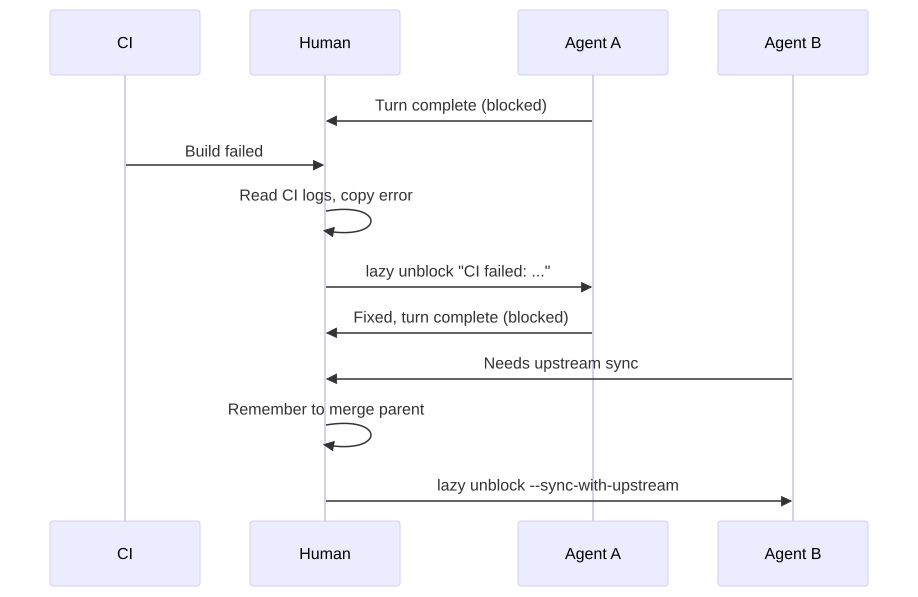
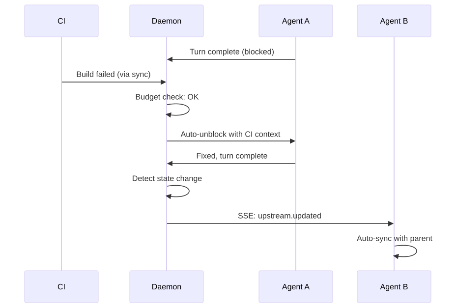
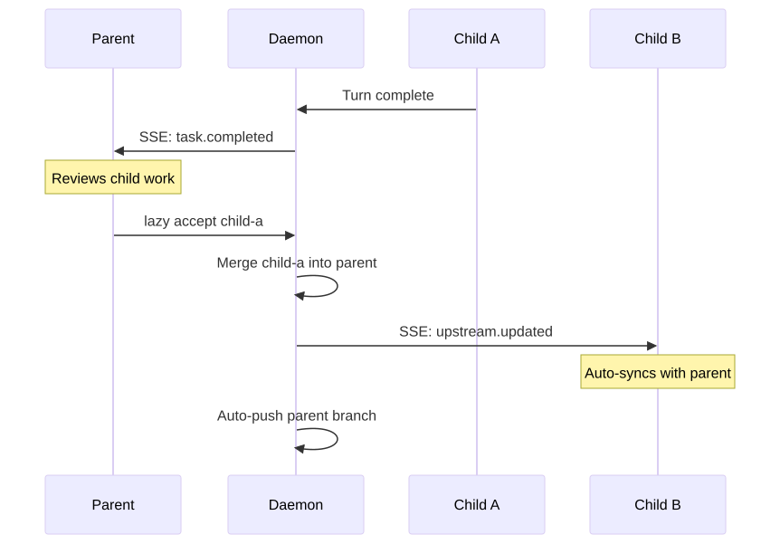

# Lazy v0.11 — The Daemon Release

**The daemon becomes the central nervous system.**

Agents, CLI, web dashboard, and git remotes all connect through the daemon.
Tasks advance themselves in response to real-world signals.

March 2026

---

# The problem: manual relay

Before v0.11, humans were the message bus.

- **CI fails** — you notice, copy the error, run `lazy unblock` with context
- **PR gets a comment** — you read it, relay it to the agent manually
- **Child task finishes** — you remember to unblock the parent
- **Branch drifts** — you notice conflicts late, spend time resolving them
- **No visibility** — `lazy list` in terminal is the only window into the system

Every signal required a human in the loop. Agents sat blocked, waiting.

---

# Before v0.11: Human as message bus



Every arrow through "Human" is latency and context-switching cost.

---

# After v0.11: Daemon as nervous system



The daemon routes signals. Humans review results.

---

# Architecture



One daemon process. Five responsibilities. Zero manual relay.

---

# Web dashboard

The daemon serves a web UI at `http://localhost:26024`.

- Task list with status, agent, and timing
- Task detail with turns, commits, and diffs
- Full-text search across tasks
- Real-time updates

**Dual-bind architecture:**
- Unix socket — CLI and agent RPC (token-authenticated)
- TCP port — browser access (localhost only, no auth needed)

```toml
[server]
port = 26024
```

---

# MCP proxy for agents

Containerized agents access lazy tools through the daemon.

<div class="columns">
<div>

**Before:**
Each builder session spun up its own TCP server. Port management, config files, separate auth.

</div>
<div>

**After:**
One daemon endpoint. Agents connect via HTTP tunnel (`host.docker.internal:26024`). Task-scoped — agents can only access their own worktree.

</div>
</div>

The builder server pattern is subsumed. No per-session servers, no port dance.

---

# Auto-push branches

Task branches push to remote automatically after state changes.

<div class="columns">
<div>

**Before:**
- Run `lazy accept`
- Remember to push
- Or wait for periodic sync
- Branch drift accumulates

</div>
<div>

**After:**
- Run `lazy accept`
- Daemon auto-pushes immediately
- Serialized queue, retry on failure
- Remote always in sync

</div>
</div>

Enabled by default. No configuration needed.

---

# Event routing

Real-time event flow through the task graph.



Events cascade. Blocked tasks auto-unblock. Working tasks get SSE.

---

# Auto-react: CI failures



The agent gets: job name, failure reason, log excerpt, and link to the CI run.
No human copy-paste. No context lost in translation.

---

# Auto-react: PR comments

When a human comments on a task's pull request:

1. Daemon detects new comment during sync
2. Deduplicates against previously seen comment IDs
3. Checks auto-react budget
4. Auto-unblocks the task with comment content

The agent gets another turn to address the feedback — no manual relay needed.

Works with both GitHub and GitLab.

---

# Safety: circuit breakers

Auto-reactions are powerful but need guardrails.

| Control | Default | Purpose |
|---------|---------|---------|
| `auto_react` | `true` | Master switch |
| `auto_react_max_retries` | `3` | Per-task limit per trigger type |
| `auto_react_backoff` | `exponential` | Delay between retries |
| `auto_react_daily_budget` | `50` | Project-wide daily turn limit |

**Escalation path:**
1. First failure → auto-unblock immediately
2. Second failure → backoff delay, then auto-unblock
3. Third failure → task paused, human notified
4. Daily budget hit → all auto-reactions paused project-wide

Counters reset on manual unblock.

---

# Terminal: `lazy watch`

```bash
# Watch a specific task's agent session (read-only)
lazy watch fix-auth

# Watch the only running task
lazy watch
```

- Attaches to the agent's tmux session in read-only mode
- See exactly what the agent is doing, without interfering
- Terminal windows auto-named: "lazy builder", "lazy pair"
- Requires tmux

---

# Default watchdog timeout

Agents now have a 2-hour watchdog by default.

If an agent produces no output for 2 hours, it's killed (SIGTERM, then SIGKILL after 5s grace).

Previously: watchdog was disabled. Hung agents ran forever.

```toml
[agent]
watchdog_output_timeout_ms = 7200000  # 2 hours (default)
watchdog_output_timeout_ms = 0        # Disable (old behavior)
```

---

# Configuration summary

```toml
# Web dashboard
[server]
port = 26024

# Watchdog
[agent]
watchdog_output_timeout_ms = 7200000

# Auto-react controls
[daemon]
auto_react = true
auto_react_ci = true
auto_react_comments = true
auto_react_max_retries = 3
auto_react_backoff = "exponential"
auto_react_daily_budget = 50
```

All features work out of the box with sensible defaults.

---

# What's next

Deferred from v0.11, candidates for v0.12:

- **Dockerfile onboarding** — auto-detect project language and generate Dockerfile
- **`lazy log`** — unified log viewer across tasks and daemon
- **Builder MCP migration** — builders use daemon MCP endpoint directly
- **Dashboard auth** — token-based auth for remote dashboard access
- **Event persistence** — durable event log for audit and replay

---

# Summary

v0.11 makes lazy a **self-advancing system**.

| Before | After |
|--------|-------|
| Human relays CI errors | Daemon auto-reacts |
| Human syncs branches | Daemon auto-pushes |
| Human unblocks on events | Daemon auto-delivers |
| Terminal-only visibility | Web dashboard |
| No agent timeout | 2-hour default watchdog |

The daemon is the central nervous system.
Agents respond to signals. Humans review results.
